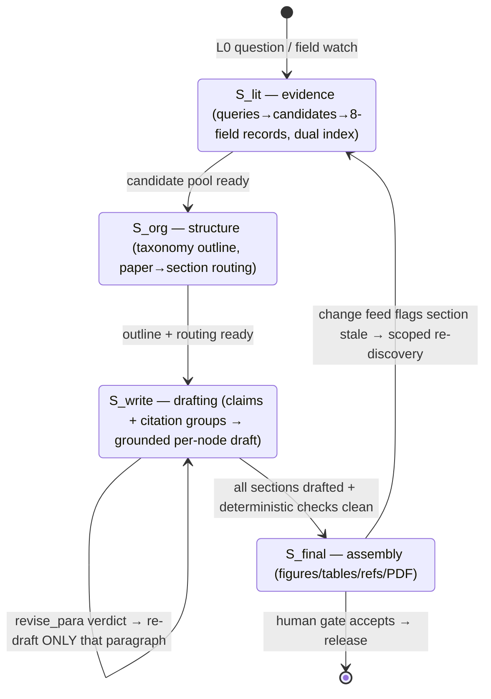

# Research Foodie — Architecture Blueprint (架构蓝图)

> **中文速览**
> 本文档规划 research_foodie 的完整架构：一套"主动式"学术研究流水线，从提问→证据→结构→写作→校验→人类评审，双轨覆盖（Track A：CS/ML 技术综述；Track B：多语言人文研究）。核心决策：
> 1. **本地优先 + 廉价 API**：编排与 7–14B 模型跑本地 CPU（Ollama）；解析/向量化/重活上远程 GPU；DeepSeek/Qwen/Kimi 等廉价 API 兜底关键节点。核心成本≈$0。
> 2. **最大程度复用已开源零组件**：DAS-2M 数据湖、DAS-Bench 评测 harness、STORM、PaperQA2（AI2 ScholarQA 亦可）、MinerU/PDF-Extract-Kit、orx、Tongyi DeepResearch。只重实现 DAS 未发布的核心（TaxPlan/PaperRouter/ClaimPlanner/限定修复环），用其 220 篇样例综述做 few-shot 与标定。
> 3. **状态机镜像 DAS**（S_lit/S_org/S_write/S_final）+ **主动回路**：变化馈送→漂移/置信标记→按策略再综合；每环节带确定性校验与人类关卡。
> 4. 复用的代码与评测脚本已下载到 `external/`（gitignored），进入实现阶段（P2+）后按本蓝图落地。

- `Updated`: 2026-09-15
- `Status`: Design phase (docs only). Implementation phases P1–P5 below.
- `Language`: English master with 中文速览 notes
- `Prerequisite docs`: `docs/refs/ai-research-tools-workflow-guide.md` (tool guide, verified 2026-09-15)

---

## 0. Purpose and scope / 目标与范围

`research_foodie` is a local-first, cost-sensitive **proactive academic-research pipeline**. It turns a research question (or a monitored field) into a citation-grounded, publication-oriented draft and keeps that draft current as the literature moves.

It is **not** a black-box "deep research" product. It is an assembled pipeline whose design borrows the only independently benchmarked architecture in this space — **DAS** (arXiv:2608.18034) — for its state model, and (re)uses released open-source components wherever possible.

Scope of this document:
1. Dual-track domain scope (C1)
2. Layered L0–L6 architecture with state model (C2/C6)
3. Reuse map: reuse-as-is vs re-implement vs build (C3)
4. Environment & cost matrix on the user's hardware (C4)
5. Proactive re-synthesis loop (C5)
6. Phased roadmap P1–P5 (C6)
7. Risks and mitigations

Out of scope: running novel experiments (that is the `orx`/experiment layer's role, integrated at L5); production deployment.

**What it does / does not (一图分清目的):**

| Does | Does NOT |
|---|---|
| Turn a research question / monitored field into a structured, citation-grounded draft | Produce an unattributed "deep research" narrative |
| Keep live deliverables current via a proactive re-synthesis loop | Auto-publish without a human gate — **never** |
| Ground every claim in a specific paper + passage (`AGENTS.md`: citations are the lifeline) | Trust LLM guess-citations; mechanical verification runs first |
| Reuse released components (DAS-2M/DAS-Bench/STORM/PaperQA2/MinerU) | Re-implement what is already released and benchmarked |
| Run cheap on local CPU + opt-in cheap API (core ≈$0) | Require paid subscriptions for the core loop |
| Integrate experiments (`orx`) only as citable evidence | Perform original research itself |

## 1. Design principles / 设计原则

1. **Citations are the lifeline.** Every claim in output must trace to a specific paper + passage; no bare LLM citations (per `AGENTS.md`, and the guide's Stage 10).
2. **Local-first, API-second, GPU-third.** Orchestration and small-model steps run on the Win11 CPU host. Parsing/embedding/self-hosted 30B-class models run on the remote GPU platform. Cheap APIs (DeepSeek/Qwen/Kimi) and hosted free services (Ai2 ScholarQA) fill remaining gaps. Core loop cost target: ≈ $0.
3. **Human gates, always.** AI ranks and revises; it never auto-accepts a manuscript-level artifact without a human checkpoint.
4. **Deterministic before semantic.** Mechanical validation (citation keys resolve, compiles, no placeholders) runs before any LLM judge — same policy as DAS.
5. **Proactive, not manual.** A scheduled discovery feed watches configured sources and marks topics for re-synthesis instead of waiting for a prompt.
6. **Reuse over rebuild.** Mirror the guide's "use what's released" stance: reuse DAS-2M/DAS-Bench harness instead of reimplementing them.

## 2. Dual-track scope / 双轨范围

| Track | Domain | Primary sources | Extraction | Synthesis stack |
|---|---|---|---|---|
| **A** | CS / ML technical literature | arXiv-DAS-2M (2M papers, 8-field structured), OpenAlex, Semantic Scholar, `orx discover` | MinerU / PDF-Extract-Kit on remote GPU | STORM outline → DAS-style routing → claim-drafted sections → DAS-Bench eval gate |
| **B** | Multilingual humanities / classical text | Google Scholar + OpenAlex + local archives; PDF/scan corpora incl. non-Latin scripts | PaddleOCR (109 langs) / Transkribus for OCR; MinerU for born-digital; LLM translation w/ expert check | Same pipeline shape; evidence layer grounded in the OCR/translation output; heavier human gates on translation fidelity |

Shared infrastructure: one orchestrator, one evidence store, one review gate (DAS-Bench harness where applicable). Track differences sit in the *evidence layer* (L2), not the architecture.

## 3. Layered architecture / 分层架构 (L0–L6)

```mermaid
flowchart LR
    subgraph L0["L0 User & Scope"]
        U["Research question / field watch"]
    end
    subgraph L1["L1 Proactive Discovery"]
        QP["Query Planner (LLM)"] --> FE["Change feed / monitors"]
        QP --> DC["Discovery backends: DAS-2M, OpenAlex, S2 API, orx discover, Ai2 ScholarQA"]
    end
    subgraph L2["L2 Evidence Layer"]
        C["Corpus + extraction: MinerU / PDF-Extract-Kit / PaddleOCR"]
        S["Structured records (8-field, DAS-2M schema)"]
        I["Index: lexical + embedding (local CPU / remote GPU)"]
    end
    subgraph L3["L3 Structure"]
        TAX["Taxonomy Planner (candidates → rooted outline)"]
        R["Paper Router (reverse paper→section routing)"]
    end
    subgraph L4["L4 Claim-led Writing"]
        CP["Claim Planner (per section: claims + citation groups)"]
        DR["Drafting: PaperQA2 / ai2-scholar-qa grounded, per node"]
    end
    subgraph L5["L5 Orchestration & Experiments"]
        LM["LangGraph state machine S_lit/S_org/S_write/S_final"]
        ORX["orx experiment layer (separate: runs ablations/experiments)"]
    end
    subgraph L6["L6 Validation & Gates"]
        DV["Deterministic validation (no LLM)"]
        EV["Semantic review: DAS-Bench eval harness (release gate)"]
        HG["HUMAN CHECKPOINTS: citation spot-check · scite / S2 retraction check · expert read"]
    end

    U --> QP
    FE --> QP
    DC -->|candidates| QP
    C --> S --> I
    I --> TAX
    QP -->|candidate pool| TAX
    TAX --> R
    R --> CP
    CP --> DR
    DR --> LM
    LM --> DV
    DV -- fail --> DR
    DV -- pass --> EV
    EV -- below threshold --> LM
    EV -- above threshold --> HG
    HG -->|accept| M["Manuscript assembly: Zotero + Pandoc + LaTeX"]
    ORX -->|experiment results as citable evidence| I
```



### 3.1 Same diagram as plain text / 纯文本流程图（任何查看器可读）

```text
[L0] Research question / field watch
          │
          ▼
[L1] Query Planner (LLM) + change feed ◄─── No events? stay idle / wait
          │  candidate pool (DAS-2M · OpenAlex · S2 API · orx discover · Ai2 ScholarQA)
          ▼
[L2] Parse PDFs (MinerU / PDF-Extract-Kit / PaddleOCR) → 8-field structured records → dual index
          │
          ▼
[L3] Taxonomy Planner (STORM outline) → Paper Router (paper → section)
          │
          ▼
[L4] Claim Planner (claims + citation groups) → grounded drafting per node (PaperQA2 / ScholarQA)
          │
          ▼
[L5] LangGraph: S_lit → S_org → S_write → S_final
          │
          ▼
[L6] Deterministic validation (no LLM)
          │  fail ──► loop back to drafting (scoped)
          ▼  pass
     DAS-Bench judge (semantic review)
          │  below threshold ──► re-plan / re-draft (scoped)
          ▼  above threshold
     HUMAN CHECKPOINTS (citation spot-check · scite/S2 retraction check · expert read)
          │
          ▼
     Manuscript assembly (Zotero + Pandoc + LaTeX)  ·  proactive loop flags stale sections
```

Layer responsibilities and the components available today (all in `external/` or the guide):

| Layer | Responsibility | Tools today | Where |
|---|---|---|---|
| L0 | Scope, question framing, field watch configuration | LLM prompt; stakeholder checklist | orchestrator |
| L1 | Turn question into queries + schedule; discover candidates | DAS-2M (HF), OpenAlex/S2 APIs, `orx discover`, Ai2 ScholarQA | guide §Stage 2; `external/DAS`, `external/orx` |
| L2 | Parse PDFs → 8-field structured records → dual index (lexical + embedding); OCR for Track B | MinerU/PDF-Extract-Kit (GPU), PaddleOCR (Track B); Qdrant/chroma (local) | `external/MinerU`, `external/PDF-Extract-Kit` |
| L3 | Candidate-grounded taxonomy → reverse paper-to-section routing | Custom LLM prompts (DAS approach); STORM `knowledge-storm` for outline seed | `external/storm` |
| L4 | Plan claims w/ citation groups; draft per node grounded in routed papers | PaperQA2 (`paper-qa`), Ai2 ScholarQA (`ai2-scholar-qa`) | `external/paper-qa` |
| L5 | State machine orchestrating L1–L4 + review loops; experiment handoff | LangGraph (DAS's S_lit/S_org/S_write/S_final shape); orx for experiment runs | guide §pipeline; `external/orx` |
| L6 | Deterministic checks → semantic review gate → human gates → assembly | Custom deterministic validator; DAS-Bench harness (`evaluation/run_eval_all.sh`, openalex judge) + 220 example surveys for calibration; Zotero+Pandoc | `external/DAS/DAS-Bench` |

**State model** (mirrors DAS; drives the LangGraph, not the docs): `S_lit` (query plan + candidates → evidence), `S_org` (taxonomy + routing), `S_write` (per-node claim plans, drafts, review status), `S_final` (figures/tables/bibliography/assembled PDF). Review verdicts are scoped: `revise_para` re-enters only that paragraph's subgraph; never regenerates wholesale (DAS's key ablation finding).

### 3.2 State machine / 状态机



Plain text equivalent:

```text
     S_lit ──► S_org ──► S_write ──► S_final ──► [release after HUMAN gate]
       ▲                      │  ▲                    │
       │                      │  └── revise_para (one paragraph only)
       │                      └──── deterministic fail → scoped re-draft
       └──────────── stale section flagged by change feed (scoped re-discovery)
```

### 3.3 End-to-end workflow sequence / 端到端工作流

**On-demand run (一次性综述):**
1. **L0** — user states a question (or reuse a saved field-watch scope).
2. **L1** — Query Planner turns it into search plans; Discovery fetches candidates (DAS-2M subset / OpenAlex / S2 / `orx discover` / ScholarQA).
3. **L2** — candidate PDFs parsed (MinerU, GPU) → 8-field structured records → lexical + embedding index; Track B adds OCR + translation with expert gate.
4. **L3** — Taxonomy Planner builds a rooted outline (seeded by STORM); Paper Router assigns each paper to its supporting section.
5. **L4** — Claim Planner emits per-section claims with citation groups; Drafting grounds each node in the routed passages (PaperQA2 / ScholarQA).
6. **L5** — LangGraph walks `S_lit→S_org→S_write→S_final`; scoped review loops (`revise_para`) re-enter only the offending areas.
7. **L6** — **deterministic** validation (citation keys resolve, no placeholders, compiles) → DAS-Bench judge (semantic) → **human** gates (citation spot-check, retraction check via scite/S2, expert read) → assembly (Zotero + Pandoc + LaTeX).

**Proactive loop (monitored field):** §6 — periodic change feed → drift/confidence flags → scoped re-synthesis → notify human. Guardrails: no re-publish without a human gate, rate-limited, changes logged in PROGRESS.md.

## 4. Reuse map / 复用地图

| Component | Status | Source | Notes |
|---|---|---|---|
| DAS-2M dataset (2M arXiv, 8-field) | **Reuse as-is** | HuggingFace (ZhikaiXu24/DAS) | Track A default corpus; free |
| DAS-Bench eval harness | **Reuse as-is** | `external/DAS/DAS-Bench` | Scoring gate; needs OpenAI-compatible judge + `PDF_EXTRACT_KIT_ROOT`; calibrate threshold on the 220 examples |
| 220 example surveys | **Reuse as-is (few-shot + calibration)** | `external/DAS/examples` | PDFs only (no intermediate artifacts) |
| STORM `knowledge-storm` | **Reuse as-is** | `external/storm` | Outline/information-gathering seed per topic |
| PaperQA2 / Ai2 ScholarQA | **Reuse as-is** | `external/paper-qa`; pip `ai2-scholar-qa` | Claim-grounded drafting + retraction check |
| MinerU / PDF-Extract-Kit | **Reuse as-is** | `external/MinerU`, `external/PDF-Extract-Kit` | L2 parsing (remote GPU); check MinerU license before commercial hosting |
| PaddleOCR | **Reuse as-is** | pip `paddleocr` (Baidu) | Track B OCR, 109 languages |
| orx CLI | **Reuse as-is** | `external/orx` (Win beta) | L5 experiment orchestration; `orx up --remote` for remote GPU |
| Tongyi DeepResearch (30.5B/3.3B) | **Reuse as-is (open weights)** | `external/DeepResearch` | Self-hosted reasoning/backbone on remote GPU; cheap API alternative: DashScope |
| open_deep_research | **Reuse as-is (reference)** | `external/open_deep_research` | Reference pipeline; DRB #6; assemble, don't black-box |
| DAS core (TaxPlan/PaperRouter/ClaimPlanner/Reviewer) | **Re-implement** | spec: arXiv:2608.18034 §method + `external/DAS` repo docs | Generation code "to be released"; our routing/planning prompts are driven by the paper + 220 examples |
| Citation verification | **Reuse (vit/build)** | `tools/citation-verify/` (from citation-verification skill) | Batch-check arXiv IDs/DOIs via CrossRef/arXiv/S2 during assembly |
| Research Foodie orchestrator | **Build custom** | this repo | LangGraph state machine + change feed + gates (L5); the glue none of the above provides |

## 5. Environment & cost matrix / 环境与成本矩阵

User environment: local Windows 11 CPU-only host + a remotely accessible GPU platform (e.g., `orx up --remote user@host`).

| Activity | Where | Cost | Notes |
|---|---|---|---|
| Orchestration, LangGraph, deterministic validation | Local CPU | $0 | Light; Python + LangGraph |
| Small LLM steps (routing, claims, drafting) | **Local CPU via Ollama 7–14B** (e.g., Qwen3-14B, DeepSeek-R1-distill-7B) | $0 | Quality drop vs frontier — accept for iteration; escalate to API for final pass |
| Critical-quality LLM steps (judge, final polish) | Cheap API: DeepSeek / Qwen / Kimi (DashScope / OpenRouter) | ≈ $0.1–2 / full manuscript | 30B+ models; aligns with DAS's own Qwen3.5 primary judge lineage |
| PDF parsing (MinerU / PDF-Extract-Kit) | Remote GPU | ≈ $0 (your compute) | DAS pipeline parity; heavy-on-GPU |
| Embedding index (1–10k papers) | Local CPU (sentence-transformers) or remote GPU | $0 | bge/m3 or similar |
| Self-hosted reasoning backbone (Tongyi 30.5B/3.3B) | Remote GPU | ≈ $0 (your compute) | optional; competitive w/ cheap APIs |
| Storage (DAS-2M subset + local corpora) | Local SSD | $0 | stream from HF on demand |
| Commercial tools ($) — optional only | n/a | Elicit ~$10–12/mo, scite ~$12–20/mo, Grammarly ~$12–30/mo | Recommended optional: one scite.ai plan if citation-audit frequency justifies |

**Rule:** nothing in the *core* loop requires a paid API. Paid tiers are escalation lanes, not prerequisites.

## 6. Proactive loop / 主动研究回路

The pipeline runs not only on demand (L0 question) but as a **monitored field loop**:

1. **Change feed (L1)** — periodic (cron/scheduler) queries against OpenAlex/S2/DAS-2M deltas + arXiv RSS for tracked topics; new items flagged by relevance model.
2. **Drift / confidence flags** — for each live deliverable, the orchestrator tracks: newest-evidence date, citation-support coverage per section, and (optionally) judge-score delta on re-run. A section whose supporting evidence has shifted materially (e.g., a cited claim has been superseded/contradicted) is flagged `stale`.
3. **Re-synthesis policy** — deterministic escalation: `flag → triage (human or auto rules) → re-discovery for that section → re-draft (scoped) → re-validate (deterministic + judge) → notify human`. Guardrails: no re-publish without human gate; rate-limited to N re-syntheses/day; changes logged in PROGRESS.md.
4. **Schema drift** — when upstream corpora change (e.g., DAS-2M updates, new arXiv months), the evidence layer reconciles incrementally (additive), never full rebuild.

## 7. Phased roadmap / 分阶段路线图

| Phase | Goal | Work | Exit criteria |
|---|---|---|---|
| **P1** | Tooling env | Install Python env, Ollama on Win11, verify `orx` beta works (or logged out of it), test remote GPU access (`orx up --remote` / SSH), smoke-test MinerU on one PDF + PaddleOCR on a scanned page | single PDF → markdown; one OCR page ok; GPU reachable |
| **P2** | Minimal vertical (Track A) | LangGraph skeleton with S_lit/S_org/S_write/S_final; DAS-2M subset ingestion; STORM outline; PaperQA2 drafting; deterministic validator | demo survey on 1 CS topic (no judge gate yet) |
| **P3** | Review gate | Wire DAS-Bench harness; calibrate threshold using 220 examples (expect ≈4.34 baseline); add `tools/citation-verify` batch check in assembly | judge score matches calibration range; citation batch-check clean |
| **P4** | Track B + proactive loop | PaddleOCR pipeline + translation layer w/ expert check; change feed + drift flags + re-synthesis policy | one humanities topic produced with human gate; auto-flag fires correctly on a synthetic corpus change |
| **P5** | Robustness + optional products | Local-vs-API quality ablation; retract/contradiction alerts (S2/scite); optional orx experiment handoff; document results in PROGRESS.md | all human gates pass on 2 domain topics; cost report ≈$0 core |

## 8. Risks & mitigations / 风险与缓解

| Risk | Mitigation |
|---|---|
| DAS generation code never released | We re-implement from the paper spec + 220 examples; DAS-Bench harness is already ours to use |
| Local 7–14B models degrade drafting quality | Use for iteration; escalate final passes to cheap APIs; keep deterministic + human gates |
| MinerU license (not plain Apache-2.0) for hosting | Open-source attribution thresholds documented; local/self-run use unaffected |
| `orx` is Windows-beta / network-reset flakiness on this host | Fallback: tarball docs + manual `orx` install from Releases; remote-GPU runs via `orx up --remote` |
| Judge self-consistency (DAS's own ρ=0.507 cross-judge) | Never treat BSC/TSQ/HDQ/MAR as verdict; always coupled with deterministic + human gates |
| Metadata skew toward English/mainstream (Track B) | Manual search + Google Scholar supplement per guide §Stage 2; OCR fidelity gates |
| Cost creep from hints of "benchmark score" worship | Budget guardrails at L5; monthly cost check in PROGRESS.md |

## 9. References / 参考来源

- DAS — arXiv:2608.18034; repo github.com/ZhikaiXu24/DAS; DAS-2M/DAS-Bench on HuggingFace.
- STORM/Co-STORM — github.com/stanford-oval/storm; Co-STORM arXiv:2412.08804; UI storm.genie.stanford.edu.
- PaperQA2 — arXiv:2409.13740; github.com/Future-House/paper-qa.
- OpenScholar — Nature 650:857–863 (2026), DOI 10.1038/s41586-025-10072-4.
- Tongyi DeepResearch — arXiv:2510.24701; github.com/Alibaba-NLP/DeepResearch (Apache-2.0).
- OpenResearch / orx — github.com/alphaXiv/openresearch-cli; docs openresearch.sh/docs.
- MinerU — arXiv:2409.18839; github.com/opendatalab/MinerU (custom license since v3.1.0, 2026-04-18).
- PDF-Extract-Kit — github.com/opendatalab/PDF-Extract-Kit.
- PaddleOCR / PaddleOCR-VL — arXiv:2510.14528; paddleocr.ai (109 languages).
- Ai2 ScholarQA — scholarqa.allen.ai; github.com/allenai/ai2-scholarqa-lib (Apache-2.0).
- open_deep_research — github.com/langchain-ai/open_deep_research (DRB #6, futuresearch.com).
- Citation verification harness — vendored at `tools/citation-verify/` from the local `citation-verification` skill (CrossRef/arXiv/S2 clients; canonical-authority workflow DOE>arXiv>CrossRef>S2>Zotero>Scholar).
- Tool guide & verification ledger — `docs/refs/ai-research-tools-workflow-guide.md` (Verified as of 2026-09-15).