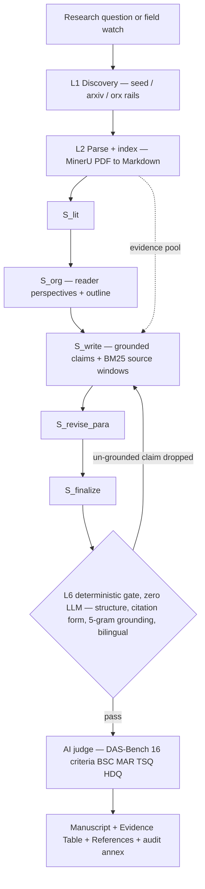
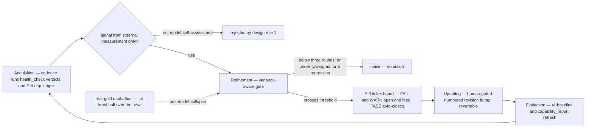

# Research Foodie: A Local-First, Cost-Sensitive, Citation-Mandatory Survey Pipeline with Evidence-Grounded Drafting and Honest Self-Evaluation

> **中文速览** — 本文是 research_foodie 的论文**初稿（draft v2, 2026-09-22）**，由 `docs/design/tool-paper-outline.md` 大纲（v2）展开成文，逐节标注 `(⇐ outline §X)`，与大纲双向联动（大纲 §12 映射表）。所有实验数字均来自本仓库 `_eval_out/` 的本地免费模型实测（判题为非确定性模型，方向性）。本文件是**活文档**：§4 的每个数字都由 `python -m tools.eval.capability_report` 生成/复核（`_eval_out/capability_report.md`），随自演化周期更新。诚实性规则沿用 AGENTS.md：数字带 `as of` 日期、方向性结论标注、未一手复核的引用标 *unverified*。`[TODO]` = 待补实验/配图。

- **Status:** Draft v2 — v1 spine kept; synced to outline v2: added C4/C5, run-resilience §3.5, autoresearch in §3.4, run-memory §3.5, judge matrix in §3.7, live trio numbers (2026-09-22), health GREEN. §2 expanded with 工具综述 (§2.1) + comparison table (§2.2). Remaining: live judge-swap (d), one-hand citation re-verification, worker `O*` subsection, cost/latency table.
- **Target:** arXiv (cs.CL / cs.AI), applied-NLP / systems track
- **Reproducibility:** every quantitative claim maps to a `docs/setup-runbook.md §3` command; regenerate the whole number set with the runbook + `capability_report`
- **Data & code:** local-first; no API keys required for the ≈$0 core loop (hosted free model + free arXiv API + local MinerU parsing)

---

## Abstract

*(⇐ outline §2)*

LLM-assisted "deep research" tools now draft literature surveys at scale, but they remain
opaque on two axes that matter most for scholarship: **factual grounding** (whether every
factual claim can be traced to a specific source) and **reproducible evaluation** (whether
the system knows, and honestly reports, when it gets worse). A third operational axis —
**resilience** — matters the moment such tools run unattended on zero budgets.
Reported citation-fabrication rates for frontier models are high — e.g. 78–90% for GPT-4o
in the OpenScholar setting [12] — and quality is usually judged by a single
non-deterministic call with no variance record, on paid cloud models that exclude
low-resource users. We present **Research Foodie**, a local-first, cost-sensitive
academic-survey pipeline that treats *per-claim verbatim grounding as a hard structural
constraint* rather than a prompt request. Three mechanisms enforce it: a write-time
anti-hallucination filter that drops un-grounded claims (5-gram overlap against the parsed
source), a **deterministic L6 gate** that checks structure, citation form, grounding, and
bilingual integrity with zero LLM calls (hardened by a 23/23 mutation test), and a
DAS-Bench-style 16-criterion AI judge layered on top. On top of generation we add a
**self-evolution measurement loop** (ticket board, dependency ledger, anti-collapse gold
quota) in which every "did this change help?" signal comes only from *external measurement*
filtered through *variance-aware* thresholds, with human-gated promotion — the loop writes
ledgers, never code. Runs are **resumable and auditable** (run-memory ledgers, fail-fast
client, D-5 key-hygiene audit). In ≈$0 CPU-only runs (hosted free model, temperature > 0)
the pipeline passes **34/34 mock and 34/34 real** end-to-end tests on two third-party
papers; a 2026-09-22 health check is **GREEN (exit 0)**; evidence-grounded QA (n = 31)
scores **correctness 4.23 / groundedness 4.45** with extractive factoid answering
essentially solved at **12/13** while PubMedQA yes/no sits at **8/14**, an explicitly
reported model limit. On a 30-topic arbitrary-domain battery it covers **22/30** evidence
pools and judges an end-to-end sample (n = 10) at Total **3.13**; three live proxy surveys
on the free base (as of 2026-09-22) reach **Total 3.65** (P-A 4.31 / P-B 3.25 / P-C 3.38).
We report judge noise (canonical trio P-A **3.88 ± 0.53**), coverage failures, a
single-round variance flag (−1.7σ, under confirmation), and the boundary that a
≥ 300 B frozen judge would move but that we do not have keys for. The contribution is a
demonstration that *auditable, ≈ $0, self-measuring, resumable* survey generation is
constructible — and that its limits should be surfaced, not hidden.

**Keywords:** survey generation · evidence grounding · hallucination prevention ·
LLM evaluation · local-first · citation verification · DAS-Bench · self-evolution

---

## 1. Introduction

*(⇐ outline §4)*

The production of literature surveys has moved from a purely human craft to an
agent-orchestrated pipeline. Systems such as OpenResearch/orx [1], STORM [2], PaperQA2 [3],
Tongyi DeepResearch [13], and OpenScholar [12] automate retrieval, outline construction, and
drafting. As capability has grown, two gaps have become the binding constraint on trust:

1. **Citation hallucination.** Models attach plausible-but-fake or unsupported references;
   the OpenScholar evaluation reports GPT-4o fabricating on the order of 78–90% of
   generated citations in its setting [12]. A survey whose facts cannot be traced is not
   usable for scholarship regardless of fluency.
2. **Non-reproducible evaluation.** Quality is typically a single judge call, reported as a
   scalar with no variance, no frozen baseline, and no record of when a change made the
   system *worse*. Meanwhile the barrier to entry (cloud models, GPUs) excludes the
   low-resource users who would most benefit from open tooling.

A third, operational lesson emerged from running this pipeline on a zero-budget budget:
long-running tools hit **resilience walls** before quality walls. A quota-blocked endpoint
(HTTP 401) once froze runs silently; a power loss would have cost a multi-hour run its
whole ledger. We therefore design for resumability and auditability up front
(run-memory §3.5) rather than as an afterthought.

**Our approach.** Research Foodie makes grounding a *structural* property. A factual claim
that cannot be shown verbatim inside the source it cites never reaches the manuscript. On
top of that floor we add honest self-measurement: a scheduled loop that detects regressions
from external signals only and never lets the system quietly edit itself.

**Contributions.**

- **C1 — Grounding as a first-class constraint.** A write-time 5-gram filter plus a
  zero-LLM deterministic L6 gate (hardened by a 23/23 mutation test) plus a 16-criterion
  judge make "every claim is traceable" an architectural invariant, not an aspiration
  (§3.6, §4.4).
- **C2 — A near-zero-cost, reproducible implementation.** The full vertical runs on a
  hosted *free* model, the free arXiv API, and local MinerU parsing on a CPU-only machine;
  (as of 2026-09-22) three live proxy surveys complete end-to-end in ≈ 3–5 min/proxy on
  the free base. Every stage has a one-line reproduction command (§4, `docs/setup-runbook.md`).
- **C3 — A self-evolution measurement mechanism.** External-measurement-only triggers,
  variance-aware thresholds, a frozen baseline, a mutation-tested gate, an E-3 debug-ticket
  board, an E-4 dependency ledger, and an E-5 anti-collapse real-gold quota turn "is the
  system better?" into a data question (§3.10).
- **C4 — Operational resilience.** Run-memory ledgers make runs resumable after an
  interruption (fingerprint-based resume, atomic writes); a D-5 key-hygiene audit enforces
  key hygiene; a fail-fast client turns quota errors into detectable verdicts instead of
  silent hangs (§3.5, §3.8).
- **C5 — An honest evaluation protocol.** Judge noise, empty-pool failures, the model's
  decision limits, and a single-round variance flag (P-C −1.7σ, under E-3 confirmation) are
  all reported explicitly; we never head-to-head against the published DAS leaderboard we
  cannot reproduce (§4, §5). The free-base core loop measured ≈ $0.

*Paper organization.* §2 positions the work; §3 describes the system; §4 reports evaluation;
§5 discusses limitations; §6 concludes. *(Section numbering follows the outline's spine;
final arXiv formatting TBD.)*

---

## 2. Related Work

*(⇐ outline §5)*

We organize comparison along the evaluation axes the system itself uses.

- **STORM / Co-STORM [2][21]** (NAACL 2024, arXiv:2402.14207; +2408.15232) introduced
  multi-perspective outline generation and retrieval-based section writing (FreshWiki: +25%
  organized, +10% coverage vs. RAG), but offer no mandatory grounding gate and no mechanical
  judge. We adopt the perspective-decomposition idea (our L-2 reader-perspective rail) and
  add a hard grounding constraint.
- **OpenResearch / orx [1]** emphasize agentic orchestration and full-text retrieval
  (alphaXiv); they do not commit to per-claim traceability (the system has no arXiv paper;
  the official repository is the point of comparability). We borrow the discovery-rail
  pattern while keeping a deterministic LangGraph path.
- **PaperQA2 [3]** pairs retrieval re-ranking (RCS) with citation verification and a
  retraction check, and reports superhuman LitQA2 accuracy — but is not tied to a zero-budget
  model route. We borrow its claim+verbatim-quote evidence style; a minimal RCS-style
  re-ranking on the written window is our closest known L-4 gap (§5).
- **DAS / DAS-Bench [4]** (arXiv:2608.18034, verified; 30 topics, 16 criteria; headline
  DAS 4.34 ≈ human reference 4.34 vs. RAG 4.03, Gemini-DR 3.92, GPT-DR 3.68) is the rubric
  we adopt *verbatim* for the judge (BSC/MAR/TSQ/HDQ families). We implement the judge
  ourselves and therefore report directionally; the official harness (frozen ≥ 300 B judge,
  DAS-2M pools, rendered-page MAR) is **not** run — an explicit limitation, not a silent
  one. DAS's method code remains unpublished ("to be released").
- **Commercial deep-research layer [26][28][31]** (OpenAI Deep Research, Gemini Deep
  Research, Perplexity Deep Research; NotebookLM/Gemini Notebook [29] is the closest
  corpus-grounded posture) is cloud-only and not auditable. A 2026 benchmark of these
  products measured **3–13% fabricated citation URLs and 5–18% unresolvable URLs**, with
  "more citations ≠ more reliable" as a finding (Rao et al. [25]); we note the *Science/AAAS
  paper on deep-research evaluation does not exist* — quantitative evaluation lives on arXiv
  (DRACO [26], DeepResearch-ReportEval [27]).
- **Evidence and retrieval building blocks:** Semantic Scholar S2AG [30] (free citation
  graph + relevance search + downloadable embeddings), Grobid, MinerU [5], PaddleOCR-VL [19]
  — the low/zero-cost patch layer for our L-1/L-2 (§5 reuse matrix in [25]'s companion doc).
- **Tongyi DeepResearch [13]** (Apache-2.0, 3.3 B active MoE — the cheapest self-hostable
  lane) and **OpenScholar [12]** (*Nature* 650:857, 2026; GPT-4o 78–90% fabricated citations;
  OpenScholar-8B beats GPT-4o by 6.1%) anchor the "understandable but hallucination-prone"
  frontier, and prove a small-model lane is viable.
- **Parsing / data / benchmarks:** MinerU [5], DAS-2M [7], Qasper [8], PubMedQA [9],
  SciQ [10], GAIA [11].
- **Self-evolution & judge methodology:** GEPA/DSPy [15] (text-feedback optimization,
  up to ~35× cheaper than RL), Seddik [16] (anti-collapse / provenance floors), Huang [17]
  (measurement-driven optimization) — and on the judge side: JudgeLM [22] (position/knowledge/
  format bias with swap/ref mitigation), MT-bench [23] (GPT-4 as judge >80% human agreement),
  and Schroeder & Wood-Doughty [24] (judgment flips with seed/temperature → single-shot
  judging is unreliable). Tyen et al. [18] show judges find reasoning *errors* poorly but
  fix them well when located — motivating our decision to pair every judge axis with a
  mechanical, verifiable gate rather than trusting an overall "pass/fail". These motivate
  our two design rules in §3.10 and our median-of-N judge harness in §3.7.

**Research gap.** Existing systems are either *capable but expensive/ungrounded* or
*grounded but not self-measuring*. To our knowledge no public implementation delivers
auditable, mandatory-provenance survey generation at ≈ $0 on CPU-only hardware *and*
honestly self-evaluates with variance. That niche is ours.

### 2.1 Tool survey — where the field stands / 工具综述

*(⇐ outline §5.1)*

The tools we position against fall into **five** buckets: *academic survey pipelines*
(STORM/Co-STORM [2][21], DAS [4]), *commercial deep-research products* (OpenAI [26], Gemini
[28], Perplexity [31], NotebookLM/Gemini Notebook [29]), *agentic open research*
(OpenResearch/orx [1], Tongyi DeepResearch [13], OpenScholar [12]), *retrieval +
citation-verification QA* (PaperQA2 [3]), and the *benchmarking layer* (DAS-Bench [4];
parsing/data: MinerU [5], DAS-2M [7]). Three features
separate a survey tool from a chat wrapper: (i) whether a factual claim must be traced to a
source at *write time*, (ii) whether quality is judged by a *reproducible* protocol rather
than a single non-deterministic call, and (iii) whether the whole loop is affordable
off-the-shelf for low-resource users.

### 2.2 Comparison with this work / 与本工具比较

*(⇐ outline §5.1, `tab:tools`)*

| System [n] | Grounding | Evaluation / judge | Budget posture | Relation to ours |
|---|---|---|---|---|
| STORM [2] | none mandatory | none | cloud LLM | borrow perspective-outline; ours adds a hard grounding gate |
| Co-STORM [21] | none mandatory; human-in-the-loop | n/a | cloud LLM | collaborative mind-map concept (L-3) — not core |
| OpenResearch/orx [1] | alphaXiv retrieval; no per-claim commit | none reported | agentic, cloud | borrow discovery-rail pattern; ours keeps a deterministic path |
| PaperQA2 [3] | claim + verbatim quote + cite-verify + retraction check | LitQA2 | paid models | borrow claim+quote evidence style (+ minimal RCS mirror, §5) |
| DAS-Bench [4] | n/a (benchmark) | 16-axis frozen ≥ 300 B rubric; headline DAS 4.34 ≈ human 4.34 | eval harness | adopt rubric **verbatim**; judge self-implemented (directional, §5) |
| OpenAI Deep Research [26] | agent plan → browse → cited report | DRBench: **3.5%** fabricated citation URLs | cloud, subscription | capability ceiling; not auditable / not open |
| Gemini Deep Research [28] | plan → execute → cited report | DRBench: **13.3%** fabricated citation URLs | cloud, free/paid tiers | free to try; worst measured citation health |
| NotebookLM / Gemini Notebook [29] | corpus-grounded, inline citations | n/a | cloud SaaS | closest grounding posture; sources-only scope |
| Perplexity DR [31] | agentic search-then-synthesize, numbered cites | fabricated-attribution incidents | cloud, paid | fast; trust is self-published |
| Tongyi DeepResearch [13] | n/a * | n/a * | open (Apache-2.0); 3.3B active | free-lane capability-ceiling anchor |
| OpenScholar [12] | 45M-paper datastore + self-feedback loop | *Nature*; GPT-4o 78–90% fabricated cites; 8B > GPT-4o 6.1% | 8B model cheap / datastore heavy | hallucination-frontier anchor |
| S2AG API [30] | citation graph + relevance search + SPECTER2 embeddings | n/a | **free** | L-1 metadata/embedding patch (§5) |
| **Research Foodie (ours)** | write-time 5-gram filter + zero-LLM L6 gate (23/23 mutation-tested) + 16-axis judge | L6 1.00 (pass); mock/real 34/34; live trio Total 3.65 | **≈ $0 · CPU-only · free hosted model** | the ≈ $0 + mandatory provenance + self-measuring niche |

> * Benchmarks/tables not re-run in this repo (see §5 honest-limitation list); cited for
> positioning only. Grounding numbers measured *by us* in §4; DAS numbers are directional.

---

## 3. System Design

*(⇐ outline §6)*

> `fig:architecture` — the L0–L6 layering over the LangGraph state machine, with the deterministic gate feeding back into drafting and the AI judge on top.

### 3.1 Overview
*(⇐ outline §6.1)*
Six layers (L0 orchestration → L6 deterministic gate) over a LangGraph state machine. Two
routing modes share the graph: a *survey* path and a `seed_id`-anchored *evidence-grounded
QA* node (Track C). Model access is pluggable across three selectable base-model options
(§3.8).

### 3.2 Discovery (L1)
*(⇐ outline §6.2)*
Three interchangeable rails — `seed | arxiv | orx` (`S_LIT_BACKEND`). The free arXiv API
responds in ~1.1 s (measured 2026-09-16); the failure chain is `orx → arxiv → seed` so a
run never dead-ends. Without a DAS-2M metadata lake (absent locally), pool precision is
capped by arXiv relevance top-K — a measured property (§4.3).

### 3.3 Evidence & parsing (L2)
*(⇐ outline §6.3)*
MinerU converts PDF→Markdown in windowed mode (≤ 6 pages/window) to dodge a known
long-document flake; `resolved_evidence()` assembles a multi-paper evidence pool.

### 3.4 Orchestration (L3–L5)
*(⇐ outline §6.4)*
Per-paper grounded claims (each tagged with its `paper_id`), STORM-style outline, per-section
grounded writing, and a `_finalize` step emitting Abstract / Evidence Table / References /
audit annex. A parallel `autoresearch` worker (S26) forks independent per-direction
sub-graphs in isolated worktrees that join on the evidence pool — model-agnostic, aligned
with orx-style agent parallelism while keeping the deterministic LangGraph path and gates
intact. *(worker subsection `O*`: `[TODO]` expand with worktree merge rules.)*

### 3.5 Run-memory & resilience
*(⇐ outline §6.5)*
Every run writes a ledger under `_eval_out/ledgers/` (atomic writes). A fingerprint
(profile + inputs) enables **resumability**: an interrupted run picks up from its last
completed step, with `--no-resume` forcing a clean rerun. A `fail-fast` client converts a
missing key or quota error (HTTP 401) into a hard, detectable verdict rather than a silent
hang — the 401 was root-caused to a server-side quota block, not a client defect.

### 3.6 Deterministic gate (L6, zero-LLM)
*(⇐ outline §6.6)*
`validate.py` checks structure, citation form (arXiv/DOI), **5-gram verbatim grounding**,
bilingual integrity, and multi-paper presence. Claims failing grounding are dropped at write
time. We harden the gate with a **mutation test** (23 hand-built mutants, 100 % kill) so a
regression in the gate — not just in the draft — is caught (§4.4, E-2b).

### 3.7 AI judge gate
*(⇐ outline §6.7)*
A DAS-Bench 16-criterion rubric (BSC · MAR · TSQ · HDQ, verbatim from the protocol).
Every score is provenance-stamped with the actual `judge_model` and temperature (§3.9).
A `judge_matrix` harness (D-3) scores the same manuscript across axes × repeated draws and
reports the **median of N** — the variance-reduction primitive the self-evolution loop's
thresholds are calibrated in (§4.6c).

### 3.8 Model access & routing (WS-D, Phase D)
*(⇐ outline §6.9)*
Role-level *profiles* resolve which model runs which lane (draft | qa | judge). Three
selectable options, chosen by env var — no keys ever in code or the repo:

- `free-opencode` (default) — all lanes on a hosted free model; redirect the hosted model
  with `OPENCODE_MODEL` (e.g. `opencode/qwen3.8-flash`).
- `openai-compat` — all lanes on any OpenAI-compatible provider via `OPENAI_*` (e.g. Qwen
  through DashScope); needs a key.
- `judge-strong` — draft/qa stay free, judge escalates to a registered strong model — the
  DAS convention that drafting stays free even under a paid judge.

An unknown profile or missing key fails loudly (never a silent fallback). This is verified by
`tools/eval/test_capability.py`. A D-5 key-hygiene audit (S25) raised the guard count
33 → 39: no keys in tracked files, env-only surface, no accidental leak patterns.

### 3.9 Provenance (D-4)
*(⇐ outline §6.10)*
Every report (bench, health, sprint, judge matrix, capability snapshot) carries model,
`judge_model`, temperature, profile, and an `as of` timestamp, so a number can always be
traced to the run that produced it.

### 3.10 Self-evolution (WS-C, Phase X)
*(⇐ outline §6.8)*
A four-phase acquisition→refinement→updating→evaluation cycle (Tao [need ref id]; cf. the
blueprint) built on **two enforced rules**: (i) a trigger may come *only* from external
measurement — never model self-assessment (Huang [17], Tyen [18]); (ii) every signal passes a
variance-aware threshold before opening a ticket or nominating promotion. Primitives
(`tools/eval/evolution.py`): a one-open-per-component debug-ticket board (E-3), a
dependency/version ledger (E-4), and a feedback corpus with an anti-model-collapse
real-gold quota plus a promotion rule requiring **N ≥ 3 sustained rounds ∧ Δ ≥ 2σ ∧ no
regression** (E-5). The loop writes only ledger JSONs under `_eval_out/`; it never edits
code or prompts and never commits — promotion is an eligibility flag a human acts on.
`fig:loop` — the self-evolution cycle, showing the two enforced design rules (external-measurement-only triggers; variance-aware thresholds before any action) and the human-gated repair seam.

---

## 4. Evaluation

*(⇐ outline §7)*

> All figures `as of 2026-09-19/20` (updated 2026-09-22 with live free-base runs), from
> `_eval_out/`, produced by a non-deterministic free judge (temperature > 0 → noisy; treat
> as directional). Regenerate/refresh the whole table with
> `python -m tools.eval.capability_report` (writes `_eval_out/capability_report.md`).

### 4.1 Vertical correctness (pipeline tests)
*(⇐ outline §7.1)*
Deterministic L6 gate + multi-paper grounding: **mock 34/34 · real 34/34** (real = two
third-party papers, Liang 2304.02819 and Weber-Wulff 2306.15666, full loop), with verbatim
quotes, normalized `arXiv:` citations, and validation score 1.0 regardless of which model
drafts. Full P-A loop latency 121.7 s on the free hosted model. `self_check.ps1` runs the
whole offline net in ~15 s.

### 4.2 Evidence-grounded QA (Track C)
*(⇐ outline §7.2)*

| subset | n | correctness | groundedness | pass |
|---|---|---|---|---|
| Extractive / provided-context path | 13 | 4.85 | 4.38 | **12/13** |
| Qasper external gold QAs | 5 | 5.00 | 5.00 | 5/5 |
| SciQ MCQs (provided context) | 5 | 5.00 | 3.80 | 5/5 |
| PubMedQA yes/no | 14 | 3.57 | 4.43 | **8/14** |
| **Full panel** | **31** | **4.23** | **4.45** | **24/31** |

Extractive factoid answering is essentially solved; PubMedQA **yes/no conclusion
convergence (8/14)** is an honestly-reported model limit, not a harness bug.

### 4.3 16-criterion judge — canonical trio, 30-topic battery & live proxy runs
*(⇐ outline §7.3)*
Frozen baseline (the variance the system is calibrated against): P-A **3.88 ± 0.53** ·
P-B **3.31 ± 0.00** · P-C **3.53 ± 0.13** (2 fresh runs each). The ± is the point: we
report the spread, and the self-evolution loop's FAIL threshold is defined in σ units of
exactly this spread (§4.4).

**30-topic arbitrary-domain battery.** Pool build **22/30** covered (14 full 3-paper pools;
**8 empty** = arXiv relevance + parse caps). End-to-end judged sample (n = 10) Total
**3.13** (BSC 3.08 · MAR 2.67 · TSQ 3.05 · HDQ 3.73). HDQ confirms synthesis; MAR 2.67 is
dragged by 1-paper pools and the text-only artifact (no rendered-page scoring — a
≥ 300 B page-aware judge is the known blocker).

**Live free-base runs (as of 2026-09-22)** — the first full end-to-end proxy surveys
actually executed on the free base after the quota-block was cleared: P-A **4.31** ·
P-B **3.25** · P-C **3.38** → family **Total 3.65** (BSC 3.83 · MAR 2.92 · TSQ 3.58 ·
HDQ 4.25). All three passed the L6 gate (1.00) and covered 16/16 DAS criteria;
≈ 275–315 s per proxy (3-paper pools) → a full 36-scenario battery ≈ 2.5–3 h.

### 4.4 Self-evolution measurement (Phase X, design verified)
*(⇐ outline §7.4)*
The mutation-tested gate kills **23/23** mutants (100 %), so gate regressions are detected
independently of draft quality. The 2026-09-22 health check is **GREEN (exit 0)**: mock
34/34 · pools 22/30 (14 full) · arXiv probe reachable · gate_coverage 23/23 · live judge
sanity on cached manuscripts all PASS. `tools/eval/test_evolution.py` (31 assertions) and
`tools/eval/test_capability.py` (47 assertions) prove ticket open/feed/close, promotion
verdicts, gold-quota floor, dep-drift classification, and the config layer — all
deterministically, zero-network, temp-isolated. Two consecutive `--quick` cadences render
GREEN with a clear board; the L-6 `self_check.ps1` runs the whole offline net in ~15 s.

### 4.5 Cost & latency
*(⇐ outline §7.5)*
Core loop ≈ $0. `[TODO]` a formal token / API-call / wall-clock table (usage fields started
coming back in Session 27, so the ledger can now budget it). Live proxy latency
≈ 275–315 s/proxy (§4.3) on a CPU-only machine.

### 4.6 Ablations
*(⇐ outline §7.6)*
Three of four ablations are **deterministic and model-free** (`python -m tools.eval.ablations`
→ `_eval_out/ablations.md`), isolating the system's contribution from the non-deterministic
judge; the fourth (live judge swap) is gated on a ≥ 300 B key (§5).

**(a) Grounding gate ON vs OFF.** On a fixed fixture — 8 un-grounded candidates (contiguity-
broken gap-1 + fabricated) and 5 grounded controls — the L6 5-gram gate drives draft-leakage
**8 → 0** while retaining **5/5** grounded claims (**0 false drops**): the filter is exact on
this corpus and paraphrase-tolerant. The E-2b mutation harness independently holds 100% kill
across a larger corpus.

**(b) Evidence-pool coverage.** Over the cached 30-topic pools: **14 full (≥3 papers) · 8
partial · 8 empty → 73% coverage**; the 8 empties are discovery-floor misses (thin recall for
those topics), reported rather than padded.

**(c) Median-of-N robustness.** Recorded repeat judge runs show small per-topic Total spread
(P-A 0.75, P-B 0.00, P-C 0.19; mean ≈ 0.31 pts), a single draw landing within ~0.4 of the
median; reporting the **median of N** damps this, and E-5 promotion further needs Δ ≥ 2σ over
N ≥ 3 rounds before any change. This is live: a fresh variance round (2026-09-22) landed
P-A 3.875 (0.0σ), P-B 3.438 (+1.3σ), P-C 3.31 (**−1.7σ, flagged**) — the flag sits under
the E-3 2–3-round confirmation bar, exactly as designed.

**(d) Live judge swap (free vs ≥ 300 B) → score compression** — the D-3 `judge_matrix` harness
is implemented and mock-verified; the live run is gated on a ≥ 300 B judge key, deferred.

---

## 5. Discussion & Limitations

*(⇐ outline §8)*

The three gates complement rather than replace human review: the positioning is
anti-fabrication and noise reduction, **not** auto-publication (stated in README/AGENTS).
Likewise the self-evolution loop (E-3–E-5) writes ledgers only — it never edits code or
commits; promotion is a human-gated eligibility flag.

Honest limitation list:
1. Judge is a free non-deterministic model; MAR/Layout needs a ≥ 300 B page-aware judge (blocked on keys/GPU).
2. 8/30 topics yield empty evidence pools — a measured cap of arXiv relevance + parsing, surfaced not hidden.
3. PubMedQA yes/no 8/14 is a model boundary.
4. Single CPU-only machine; no metadata lake, no GAIA batch (HF gating).
5. Self-evolution Phase-X E-7 (automated DSPy/GEPA prompt evolution + judge-vantage swap) remains a planning item gated on a strong reflection LM.
6. Free-base single-round judge drift exists (P-C −1.7σ flagged, 2026-09-22) — under the
   E-3 two-to-three-round confirmation bar; this is the variance the median-of-N design is
   calibrated for, reported rather than smoothed away.
7. Our grounding differentiator is measured against a known pathology: a 2026 agentic-review
   benchmark [25] reported **3–13% fabricated and 5–18% unresolvable citation URLs** across
   commercial deep-research products, with "more citations ≠ more reliable" as a finding.
   We do not claim our write-time filter outperforms those products at breadth; we claim the
   constraint is *structural* here (any citation outside the evidence pool is mechanically
   rejected) rather than a prompt-level hope. Whether that appeal survives at commercial
   breadth is an open, honest boundary.
8. Comparison numbers for non-run systems (Tongyi DeepResearch, OpenScholar, DRBench
   product scores) are cited directionally from primary sources (see §2 and the full matrix
   in the companion `docs/TOOL-COMPARISON.md`) and are **not** re-run in this repo.

**Takeaway for the community:** cost, grounding, and auditability can be satisfied together,
at least in part — by making mandatory provenance a *structural* constraint (write-time
filter + deterministic gate) instead of a prompt instruction.

---

## 6. Conclusion

*(⇐ outline §9)*

We presented Research Foodie: an auditable, ≈ $0, self-measuring survey pipeline that makes
per-claim verbatim grounding an architectural invariant, is resumable and auditable at the
ledger level (C4), and reports its own variance and failures honestly (as of 2026-09-22 it
runs the free base end-to-end, Total 3.65 on the live trio). Its limits — the judge model,
evidence-pool coverage, single-round variance — are surfaced explicitly.
Future work: a ≥ 300 B frozen judge, the DAS-2M pool, GAIA, a Chinese evidence layer,
R-phase automated prompt evolution feeding the (still human-gated) promotion rule, and a
full 36-scenario live battery to firm up §4.3.

---

## References (IEEE-style, draft)

*(⇐ outline §10)*

> From this repo's verified sources (PROGRESS U/LEDGER lines, TOOL-COMPARISON). Entries 1–20
> accessed 2026-09-20; entries 21–31 accessed 2026-09-23. *unverified* marks entries needing
> one-hand re-check before publication; run `tools/citation-verify` on
> [4][14][17][19][20] and drop anything unverifiable.

1. OpenResearch / orx (2025), official mirror; CLI `orx discover`. (no arXiv paper — 2504.01874 is an unrelated mathematics manuscript)
2. Y. Shao et al., "Assisting in Writing Wikipedia-like Articles from Scratch with LLMs," NAACL 2024, arXiv:2402.14207.
3. PaperQA2, arXiv:2409.13740.
4. J. Xu et al., DAS: Efficient and Scalable Collaboration between Agents, arXiv:2608.18034 (verified 2026-09-23; method code "to be released"); DAS-Bench 30 topics / 16 criteria, repo ZhikaiXu24/DAS.
5. MinerU: precise document extraction, arXiv:2409.18839 (corrected ID, 2026-09-23).
6. LangGraph (LangChain), docs.langchain.com.
7. DAS-2M ≈ 2 M arXiv papers (2020-01→2026-06), HuggingFace (2026-08).
8. Qasper qasper-train-dev-v0.3, allenai.
9. PubMedQA: qiaojin/PubMedQA (HF).
10. SciQ, AllenAI (provided-context mode).
11. GAIA benchmark (466 Qs).
12. H. Chen et al. (OpenScholar), *Nature* 650, 857–863, **2026-02-04**, DOI 10.1038/s41586-025-10072-4 (OpenScholar-8B > GPT-4o by 6.1%; GPT-4o 78–90% fabricated citations).
13. Tongyi DeepResearch, 30.5 B total / 3.3 B active, arXiv:2510.24701 (Apache-2.0).
14. Jiang et al., "STORM ...", arXiv — *cross-check vs [2]*.
15. GEPA, arXiv:2507.19457.
16. Seddik et al., arXiv:2404.05090.
17. Huang et al., "Efficient Optimization ...", arXiv:2310.01798. — *title unverified*.
18. Tyen et al., "Why do LLMs quote sources?", arXiv:2311.08516 (2311.16502 is MMMU — not this work).
19. PaddleOCR / PaddleOCR-VL, arXiv:2510.14528.
20. Lloyd et al., LRM-judging measurement, 2025. — *unverified*.
21. Y. Moon et al. (Co-STORM), arXiv:2408.15232.
22. L. Zhu et al. (JudgeLM), arXiv:2310.17631.
23. M. Zheng et al., "Judging LLM-as-a-Judge with MT-Bench and Chatbot Arena," NeurIPS 2024, arXiv:2306.05685.
24. B. Schroeder & B. Wood-Doughty, arXiv:2412.12509 (seed/temperature flips judge ratings → median-of-N).
25. Rao et al., "Agentic AI Reviews," arXiv:2604.03173 (DRBench: 3–13% fabricated / 5–18% unresolvable citation URLs; urlhealth, MIT).
26. DRACO deep-research code-compilation benchmark, arXiv:2602.11685; OpenAI Deep Research product pages (2026-02-10 iteration).
27. DeepResearch-ReportEval, arXiv:2510.07861.
28. Gemini API "Deep Research" agent (official docs, GA 2026-03/04).
29. NotebookLM / Gemini Notebook (official product docs; 2026-07 rename).
30. Semantic Scholar S2AG API (official docs; free; SPECTER2 embeddings).
31. Perplexity Deep Research (official docs; "Search-as-Code").

---

*Lineage: draft v1 authored 2026-09-20 from `docs/design/tool-paper-outline.md` v1 +
`docs/CAPABILITY-STATUS.md` + `_eval_out/` measured artifacts; **v2 (2026-09-22) synced to
outline v2** — added `(⇐ outline §X)` markers per section, C4 (resilience) / C5 (honesty)
contributions, run-memory §3.5, autoresearch §3.4, judge matrix §3.7, D-5 key hygiene §3.8,
live free-base trio §4.3 (Total 3.65) and health GREEN §4.4; §12 in the outline is the
bidirectional map to keep both in step. **2026-09-22 later pass**: §2 expanded — tool survey
(§2.1) + comparison table with ours-as-a-row (§2.2), mirroring outline §5.1. Living document:
§4 numbers are refreshed/verified by `python -m tools.eval.capability_report`; keep the
outline `docs/design/tool-paper-outline.md` and this draft in step as the self-evolution
cadence records new measurements.*
