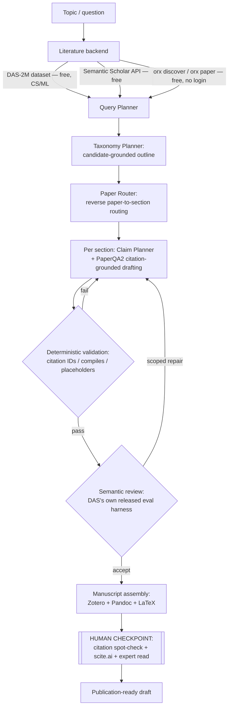

# AI Tools for Research: A Complete Workflow Guide

opencode -s ses_f5bf15129ffebl218MiLnofD3w

> **Verified as of 2026-09-15.** All claims spot-checked against primary sources; updated figures and a Verification Ledger are appended at the end of this document.

*Compiled from live research as of August 30, 2026. Read the "How to use this guide" note below before you start — pricing in this space moves fast and disagrees across sources even within the same month.*

## How to use this guide

This covers the full arc: framing a question → finding literature → triaging it → reading deeply → managing references → analyzing data/code → drafting → editing → verifying citations → checking integrity → presenting. Every tool is marked **Free** / **Freemium** / **Paid**. Where sources disagreed on exact pricing (which happened constantly — see the note below), I give a range and flag it.

**A finding worth stating up front:** while researching this, I pulled pricing for the same tool from 5–8 independent sources and routinely got numbers that varied 20–50% (Elicit's "Plus" tier alone was quoted at $10, $12/mo annual, $12/mo flat, and $12/user/mo across different sources published weeks apart). This isn't sloppiness on any one source's part — vendors in this category change pricing and packaging genuinely often. Treat every dollar figure below as **directional, not contractual**, and check the vendor's own pricing page before paying.

---

## Quick-reference table

| Tool                             | Stage                                           | Free tier?                                 | Paid from                                             | Best for                                                                |
| -------------------------------- | ----------------------------------------------- | ------------------------------------------ | ----------------------------------------------------- | ----------------------------------------------------------------------- |
| Semantic Scholar                 | Discovery                                       | Yes, fully free                            | —                                                    | No-cost paper search, TLDR summaries, citation graph                    |
| Google Scholar                   | Discovery                                       | Yes                                        | —                                                    | Broadest coverage, incl. non-English/older/humanities work              |
| Consensus                        | Discovery                                       | Yes (~20 searches/mo)                      | ~$9–15/mo                                            | Yes/no evidence questions in medicine & social science                  |
| Elicit                           | Discovery/Screening                             | Yes (2 reports/mo)                         | ~$10–12/mo (Plus), ~$42–49/mo (Pro)                 | Structured data extraction, systematic reviews                          |
| Research Rabbit                  | Discovery                                       | Yes (capped since late 2025)               | Paid tier exists post-Litmaps acquisition             | Visual citation mapping from a seed paper                               |
| Connected Papers                 | Discovery                                       | Yes (monthly cap)                          | Paid tier available                                   | Quick visual orientation in a new field                                 |
| Perplexity                       | Discovery/Deep Research                         | Yes (5 Pro searches/day)                   | $20/mo (~$16.67/mo annual)                            | Fast, heavily-cited answers across the open web                         |
| NotebookLM (now Gemini Notebook) | Reading/Synthesis                               | Yes (50 sources/notebook)                  | $4.99–$99.99+/mo via Google AI plans                 | Source-grounded Q&A over your own document set                          |
| SciSpace                         | Reading/Writing                                 | Yes (100 credits/mo)                       | ~$12–20/mo (Premium)                                 | Chat-with-PDF, autonomous "Deep Review" synthesis                       |
| Zotero                           | Reference mgmt                                  | Yes, fully free/open-source                | —                                                    | Best all-around free reference manager                                  |
| Paperpile                        | Reference mgmt                                  | No (trial only)                            | ~$3/mo                                                | Google Docs–native citation workflow                                   |
| Mendeley                         | Reference mgmt                                  | Yes                                        | Paid storage tiers                                    | Built-in PDF reader; Elsevier-owned                                     |
| EndNote                          | Reference mgmt                                  | No                                         | ~$274+/yr                                             | Institutional/legacy standard                                           |
| Jenni AI                         | Writing                                         | Yes (200 words/day)                        | ~$12–20/mo                                           | Drafting with citations from sources you already have                   |
| Paperpal                         | Writing/Editing                                 | Yes                                        | ~$25/mo (Prime)                                       | Journal-grade language + submission readiness checks                    |
| Writefull                        | Editing                                         | Yes (limited)                              | Paid tiers                                            | Scholarly English polish, Overleaf-native                               |
| Trinka                           | Editing                                         | Yes                                        | ~$20/mo or ~$80/yr                                    | Non-native-English academic grammar (incl. Chinese-pattern errors)      |
| Grammarly                        | Editing                                         | Yes                                        | ~$12–30/mo                                           | General writing, not academic-specialized                               |
| QuillBot                         | Editing                                         | Yes                                        | ~$8–20/mo                                            | Paraphrasing, grammar, basic citation generation                        |
| scite.ai                         | Citation verification                           | No (7-day trial)                           | ~$12–20/mo                                           | Checking whether a citation is*supported or contradicted*             |
| Julius AI                        | Data analysis                                   | Yes                                        | ~$29–37/mo                                           | Conversational data analysis, sandboxed code execution                  |
| Cursor                           | Coding                                          | Yes                                        | $20–200/mo                                           | AI-native code editor, multi-model                                      |
| GitHub Copilot                   | Coding                                          | Yes (limited, usage-unbilled)              | $10–100/mo (usage-based since June 2026)             | IDE-embedded coding assistant                                           |
| Claude Code                      | Coding                                          | Via Claude Pro+                            | $20–200/mo                                           | Agentic coding, strong on complex/long-context tasks                    |
| ChatGPT Deep Research            | Deep research agent                             | Yes (~5/mo)                                | $20/mo (Plus), $200/mo (Pro)                          | Longest, most source-dense autonomous reports                           |
| Gemini Deep Research             | Deep research agent                             | Yes (5/mo)                                 | $4.99–19.99/mo                                       | Fastest good-quality reports; Docs/Drive-native                         |
| Claude (Research/Projects)       | Deep research agent                             | Limited                                    | $20/mo+                                               | Long-context synthesis of contradictory sources                         |
| LangChain Open Deep Research     | Autonomous agent (open-source)                  | Yes, free/open-source                      | Your own API costs                                    | Configurable, build-your-own deep researcher                            |
| GPT Researcher                   | Autonomous agent (open-source)                  | Yes, free/open-source                      | Your own API costs                                    | Most established, easiest to self-host                                  |
| PaperQA2                         | Autonomous agent (open-source)                  | Yes, free/open-source                      | Your own API costs                                    | Citation-accuracy-critical scientific literature QA                     |
| STORM / Co-STORM                 | Autonomous agent (open-source)                  | Yes, free/open-source                      | Your own API costs                                    | Structured, cited outline of an unfamiliar topic                        |
| Ai2 ScholarQA                    | Autonomous agent (open-source)                  | Yes, free/open-source (scholarqa.allen.ai) | Your own API costs (self-hosted)                      | Multi-paper QA over 11M+ full-text papers & 100M+ abstracts; Apache-2.0 |
| OWL                              | Autonomous agent (open-source)                  | Yes, free/open-source                      | Your own API costs                                    | Strongest open-source agent framework (GAIA-leading)                    |
| Deep Academic Survey (DAS)       | Autonomous agent (architecture, not yet usable) | Dataset/benchmark/examples free            | — (generation code not yet released)                 | Publication-oriented survey architecture (blueprint only for now)       |
| OpenResearch (`orx`)           | Experiment orchestration                        | `orx discover`/`orx paper` fully free  | Paid compute marketplace for parallel experiment runs | Parallel agentic ML experiments in isolated worktrees                   |
| Ai2 Paper Finder                 | Autonomous agent                                | Yes, fully free                            | —                                                    | Transparent, step-by-step academic search                               |
| Undermind                        | Autonomous agent                                | Limited free                               | Paid (subscription)                                   | Polished exhaustive academic search, less transparent                   |
| Rayyan                           | Systematic review screening                     | Yes (3 reviews)                            | ~$5–13/mo                                            | Free collaborative title/abstract screening                             |
| Covidence                        | Systematic review                               | No                                         | $339/yr per review                                    | End-to-end, Cochrane-aligned pipeline                                   |
| Gamma                            | Presentation                                    | Yes (400 credits, one-time)                | ~$8–25/mo                                            | Prompt-to-deck for sharing findings                                     |
| PaddleOCR                        | OCR (multi-script)                              | Yes, free/open-source                      | —                                                    | Chinese-script OCR, 109 languages                                       |
| DeepL                            | Translation                                     | Yes (5,000 chars)                          | ~$8.74/mo+                                            | Strongest on European language pairs                                    |

---

## Stage 1 — Framing the question

Before touching a database, a general-purpose model earns its keep just scoping the problem: turning a vague interest into a searchable question, drafting a PICO/PECO framework, brainstorming search terms and synonyms in multiple languages, or sanity-checking whether a question has already been answered. **Claude, ChatGPT, and Gemini** are all reasonable choices here — none has a structural advantage at this stage, since it's pure conversation, not retrieval. The only real trap: don't let the model's confident-sounding background knowledge substitute for an actual literature search in the next stage. A fluent paragraph about "what's known" from a base model is not evidence of what's known — it's a guess dressed as a summary, and it will occasionally be wrong in ways that sound exactly as authoritative as the parts that are right.

## Stage 2 — Literature discovery & search

This is the most crowded category, and the tools split cleanly by philosophy: pure discovery engines vs. answer-synthesis engines.

**Semantic Scholar** (free, no gating whatsoever) is the strongest default starting point for anyone in CS, AI, or biomedicine. It indexes 237M+ papers, generates TLDR one-line summaries so you can triage relevance without reading abstracts, and flags "Highly Influential Citations" — the ones that actually shaped a paper's argument rather than being dropped in passing. Its SPECTER2 embeddings are also available via a free API if you want to build your own similarity search. The catch: coverage skews toward English-language, well-indexed, recent scholarship — exactly the kind of work that's easiest to crawl. (Index count changes continuously; the ~237M figure is from the Semantic Scholar search page as of 2026-09-15.)

**Google Scholar** remains, unglamorously, the broadest net — it's the one tool in this list still likely to surface an obscure regional journal, an older monograph, or non-English scholarship that AI-native tools miss because their training/indexing corpora underweight it. It has no AI layer, but it's still worth using in parallel with everything else here, specifically *because* it doesn't share their blind spots.

**Consensus** ($0 free / ~$9–15/mo Premium / ~$45/mo Deep) is built for a narrower, useful task: answering yes/no or agreement-level questions against 200M+ peer-reviewed papers, visualized via its "Consensus Meter." It's strong in medicine and social-policy domains with a deep empirical base, and every synthesized claim links to a source. It cannot search the open web, grey literature, or anything outside peer review — so it's a bad fit the moment your question needs a working paper, a dataset, or a government report.

**Elicit** ($0 free Basic / ~$10–12/mo Plus / ~$42–49/mo Pro) is the closest thing to a purpose-built systematic-review assistant: it extracts data into structured comparison tables across dozens or hundreds of papers, generates sentence-level citations for every claim, and its Pro tier's "Research Agent" can search beyond academic papers into trial registries and regulatory filings. It's explicitly strongest for empirical domains with concrete results (biomedicine, ML) and self-reports ~94–99% accuracy on its extractions (96% is the headline figure on its own product page) — worth repeating, because even at that top-end figure roughly 1 in 20 extracted data points may need a correction, and the tool itself asks you to check its work rather than trust it blind.

**Research Rabbit** and **Connected Papers** are the visual-mapping tools: drop in a seed paper and get an interactive graph of citations, co-citations, and semantic neighbors. Research Rabbit was acquired by Litmaps in late 2025 and moved from fully free to a freemium model (free tier now capped around 50 seed papers per search); Connected Papers has a similar monthly cap. Both share a documented weakness worth taking seriously: citation networks structurally favor older, mainstream, English-language, well-indexed work. Negative results, books, regional journals, conference proceedings, and scholarship from outside the Anglophone academic mainstream are systematically less visible in the graph — not because they're less real, but because the underlying metadata providers (Crossref, Semantic Scholar, OpenAlex) index them less completely. If your field or sources sit outside that mainstream, treat these maps as a supplement to, not a replacement for, manual search.

**Perplexity** ($0 free / $20/mo Pro) is a different animal — a general AI search engine, not an academic-only one. It's the fastest of the bunch, gives transparent inline citations, and scores well on factual-accuracy benchmarks, but it typically surfaces 10–30 sources per answer (versus 100+ for some Deep Research competitors) and can't run code or do structured data extraction. Good for fast orientation and fact-checking; not a systematic-review tool.

## Autonomous research agents: commercial "Deep Research" and the open-source alternatives

This category deserves its own section rather than a slot inside discovery, because these tools don't just find papers — they compress discovery, reading, and synthesis into one autonomous run and hand you a finished, cited report. That compression is exactly why they need more scrutiny than anything else in this guide.

**On "open deep research" specifically**, since it isn't one single thing: the most direct match for that name is LangChain's `open_deep_research` (github.com/langchain-ai/open_deep_research) — free, fully open-source, and configurable across your choice of model provider, search tool, and MCP servers, with active development (new posts as recently as this month). It's designed to be assembled, not installed and forgotten — you supply your own API keys for both the LLM and the search backend, so "free" means free of license cost, not free of usage cost. On the FutureSearch Deep Research Bench leaderboard it ranked #6 among tested agents as of its last public update — respectable, not top-tier — and LangChain also publishes a free companion course walking through the architecture, which makes it a genuinely good starting point if you want to understand or customize the pipeline rather than use a black box.

**The commercial "Deep Research" products** (listed in the table above but not yet evaluated head-to-head): the real differences are speed, depth, and grounding, not raw capability.

- **ChatGPT Deep Research** (Plus $20/mo, Pro $200/mo) produces the most source-dense reports (50–200 sources) and runs longest (10–30 min) — best when you want the single most exhaustive report and can wait for it.
- **Gemini Deep Research** ($4.99–19.99/mo via Google AI plans) is fastest to a good-enough report (5–15 min) and integrates natively with Docs/Drive/Gmail, which matters if the output needs to land directly in files you already work in.
- **Perplexity Deep Research** ($20/mo) is fastest overall (2–5 min) and most transparent about citations as you read, but pulls fewer sources (10–30) and can't run code or do numerical analysis.
- **Claude** (Pro $20/mo+) doesn't brand a separate product the way the others do, but its research mode — long-context, tool-using, web-search-grounded — tends to do best specifically at reconciling *contradictory* sources rather than just aggregating agreeing ones, which matters more than raw source count once a field is genuinely contested.

**For more specialized, purpose-built alternatives**, several open-source projects exist specifically to fix problems the general-purpose products above still have:

- **PaperQA2** (Future-House/paper-qa, free/open-source) targets exactly the failure mode this whole guide keeps warning about — citation fabrication. It's a retrieval-augmented agent purpose-built for scientific literature: every claim traces to a specific passage, cited papers get an automatic retraction check, and its creators report it beating PhD- and postdoc-level biology researchers on a literature-retrieval benchmark (LitQA2). Read that "superhuman" framing as a self-reported result from the team that built it — though it has been independently compared against since; one follow-up (AI2's OpenScholar, whose underlying method was subsequently published in *Nature* in 2026) reports beating PaperQA2 by roughly 6% using a fully open pipeline with cheaper retrievers. FutureHouse also runs a hosted platform built on PaperQA2 — Crow, Falcon, Owl, and a chemistry-specific Phoenix — if you'd rather not self-host.
- **STORM / Co-STORM** (Stanford OVAL, free/open-source — or free with zero setup via the official hosted UI at storm.genie.stanford.edu; runtimes vary by topic, with the tool itself reported in the multi-10s-of-minutes range in third-party runs, not instantaneous) is a different shape of tool, and probably the single best-fitted one here for the literature-review stage specifically: instead of answering one question, it takes a topic and produces a structured, multi-section, cited overview — discovering different perspectives first, then simulating a conversation between a "writer" and an "expert" grounded in web sources to build an outline before it writes. Stanford's own framing is honest and worth repeating rather than a marketing gloss: it's explicitly a *pre-writing* tool that "cannot produce publication-ready articles," which experienced Wikipedia editors have found useful for structuring an unfamiliar topic fast — not a finished draft. Co-STORM adds a live human-in-the-loop mode.
- **GPT Researcher** (free/open-source, gptr.dev) is the most established, widely deployed general-purpose option — older than most of this field, with the largest existing community. It's the reasonable default if you want something well-documented and easy to get running, rather than the most specialized or highest-scoring choice.
- **OWL** (Optimized Workforce Learning, free/open-source) is worth knowing about if you're building rather than just using: a hierarchical multi-agent framework that currently leads open-source frameworks on GAIA (a general agentic-task benchmark, not research-specific), with native browser automation, document parsing, and code execution alongside search — the strongest technical foundation here if you want something more capable than any tool above used as-is.
- **Ai2 Paper Finder** (Allen Institute for AI, free) is the transparent counterpart to a well-regarded but opaque commercial tool called **Undermind** (subscription, dating to early 2024): where Undermind's retrieval process is a black box even to satisfied users, Ai2 Paper Finder shows every step — query analysis, search strategy, relevance judgments — which matters if you need to explain how you found something, not just that you found it.
- **Ai2 ScholarQA** (Allen Institute for AI, free and open-source at scholarqa.allen.ai, code on GitHub under Apache-2.0) is the strongest free addition in this category as of this revision: a multi-paper scientific question-answering system synthesizing answers with citations across a corpus of 11M+ full-text papers and 100M+ abstracts. It's the closest open, hosted equivalent to what PaperQA2 does self-hosted, and its library (`ai2-scholar-qa`) is directly embeddable in your own pipeline. Living demo at scholarqa.allen.ai; no rate limits stated for the hosted demo as of 2026-09-15.

**The furthest thing along toward genuinely publication-oriented output, published as I was researching this**: **Deep Academic Survey (DAS)** (Zhejiang University / Shanghai Jiao Tong University, arXiv, August 2026) aims at a harder target than everything above — an actual *publication-oriented* survey manuscript, not just a cited report — and its own comparison table positions it directly against STORM, PaperQA2, and both commercial Deep Research products. Its architecture is worth understanding even before you can run it, because it's the clearest published blueprint for exactly the kind of system this section's closing part helps you build: a **stateful, closed-loop pipeline** around an explicit shared manuscript state with four parts — literature, organization, writing, and finalization. Concretely: (1) a precomputed **literature metadata lake** (DAS-2M, ~2 million arXiv papers, each parsed into eight structured fields rather than bare title/abstract, so a paper doesn't need re-extracting for every new survey); (2) a **Taxonomy Planner** that organizes retrieved candidates into a rooted outline, followed by **reverse paper-to-section routing** — an agent evaluates every candidate against every outline node and assigns it where it actually fits, rather than retrieving separately per section, which its own ablations show is one of the two mechanisms that matters most; (3) **hierarchical claim-level drafting**, where every paragraph is planned as a sequence of specific claims with an attached citation group *before* any prose gets generated; and (4) a **scoped semantic review-and-repair loop** — a Reviewer agent that, on finding a defect, picks the *narrowest* fix (revise one paragraph, replan one paragraph, or replan a whole subsection) instead of regenerating everything, the other mechanism its ablations show matters most.

On DAS-Bench (a 30-topic benchmark the same authors built, judged on 16 criteria spanning citation quality, taxonomic synthesis, discourse quality, and manuscript reliability), DAS scored 4.34/5 overall — matching the human-written reference surveys used for comparison, ahead of a strong Naive-RAG baseline (4.03), Gemini Deep Research (3.92), GPT Deep Research (3.68), SurveyForge (3.78), and AutoSurvey (3.73). Blinded domain experts preferred DAS over Naive RAG on 27 of 30 topics. Worth taking seriously rather than dismissing as marketing: the methodology includes real ablations and a second-judge cross-check (Kimi K2.6 alongside the primary Qwen3.5 judge), which found a weaker but *consistent* ranking — an honest thing for the authors to report rather than bury. Still, it's their own benchmark and baselines, so treat the specific numbers the way this guide treats every self-reported result: as a serious data point, not a verdict.

**The catch, and it matters for anything you'd try to build from this today**: only the benchmark, the DAS-2M dataset, and 220 example generated surveys are actually released (github.com/ZhikaiXu24/DAS). The core generation pipeline — the part that would let you point DAS at your own topic — is explicitly marked "to be released" in the repository as of this writing. So DAS isn't a tool you can use yet; it's an unusually well-documented **architecture with proof it works**, plus a free dataset and 220 real example manuscripts worth reading for a sense of the ceiling. One scope note: DAS-2M is arXiv-only, so this whole system is CS/ML-specific — it doesn't reach humanities or classical-text sources.

**A note of honest skepticism on "which one is actually better."** There isn't one canonical leaderboard here. I found at least four differently-built benchmarks in circulation for this category — FutureSearch's Deep Research Bench, a separate and confusingly similarly-named "DeepResearch Bench," GAIA, and DeepSearchQA among them — each using different tasks and different judge models, and the judge models themselves keep getting swapped out as they're deprecated (one benchmark switched its official judge from Gemini 2.5 Pro to GPT-5.5 in May 2026 purely because Google deprecated the old judge). One genuinely useful finding from FutureSearch's own benchmark: a strong general reasoning model (OpenAI's o3) doing search on its own actually outperformed OpenAI's own dedicated "Deep Research" product on their tasks — a good reminder that a wrapped, branded product isn't automatically better than a strong model with search access. And be specifically wary of any vendor's own page claiming a "#1 leaderboard" ranking; I came across one product marketing exactly that claim on its own site without independent verification from the benchmark's actual maintainers — a pattern worth watching for generally in this category, not just distrusting in that one instance.

**If you'd rather build than use one of the above:** several labs — mostly Chinese labs, Alibaba's Tongyi Lab prominent among them — released open-weight models in 2025–2026 fine-tuned specifically for research and web-agent tasks rather than general chat. **Tongyi DeepResearch** (30.5B parameters, mixture-of-experts with only 3.3B active per token, trained end-to-end for long-horizon search and synthesis) is the most complete and well-documented single release, alongside a cluster of narrower web-agent models (WebSailor, WebDancer, ASearcher) from the same and adjacent labs. These are backbones, not products — you'd still need to wrap one in something like LangChain's open_deep_research or your own agent loop to get a usable tool — but if you're already doing MLOps work, they're a legitimate alternative to defaulting to a GPT/Claude/Gemini API call as the reasoning engine underneath a custom research pipeline.

## Stage 3 — Rapid triage & systematic screening

Once you have a candidate pool that's too large to read manually, this is where AI genuinely saves the most time — and where you most need to keep a human in the loop.

**Rayyan** (free for 3 active reviews / ~$5–13/mo for more) is the most widely used free collaborative screening tool, cited in thousands of published systematic reviews. It learns your include/exclude decisions and ranks the remaining pool by predicted relevance (a five-star system), and its "Blind Mode" lets two reviewers screen independently with decisions hidden until both are done — genuinely useful for meeting the dual-independent-screening standard that rigorous reviews require. Its scope is narrow by design: title/abstract screening only, nothing for extraction, risk-of-bias, or synthesis.

**Covidence** ($339/year per review, no monthly option) is the Cochrane-aligned, end-to-end alternative: import, dedupe, screen, extract with customizable forms, run validated risk-of-bias tools, and generate PRISMA diagrams and flow charts. Notably, as of my research, it ships **no native AI screening** — its value is workflow structure and methodological rigor, not automation. **ASReview** and **Colandr** are free, open-source alternatives with ML-assisted screening if the Covidence price tag is a barrier.

The one rule every source on this topic converges on: **AI ranks, it does not decide.** Screen a random sample by hand to sanity-check the model's judgment, and never auto-include or auto-exclude a paper without a human actually looking at it.

## Stage 4 — Deep reading & comprehension

**NotebookLM** — renamed **Gemini Notebook** by Google in July 2026, same product — is the standout here for a specific reason: it only answers from documents you've actually uploaded, which structurally limits (though doesn't eliminate) hallucination compared to open-ended chat. The free tier gives 100 notebooks, 50 sources per notebook, and 50 chat questions a day; paid tiers (bundled into Google AI plans, roughly $4.99–$99.99+/mo) mostly raise those ceilings rather than add new capability, up to 300–600 sources per notebook on the higher tiers. One limit doesn't move with your plan, though: every source is capped at 500,000 words or ~200MB regardless of tier, so one enormous document will hit a wall no upgrade fixes — you'd need to split it. It also generates "Audio Overviews" (a podcast-style discussion of your sources) and "Video Overviews," which are genuinely useful for a first-pass orientation to a document set, though not a substitute for reading the primary sources. Worth knowing: your uploaded files are processed on Google's servers, which matters if anything you're feeding it is unpublished, embargoed, or otherwise sensitive.

**SciSpace** ($0 free / ~$12–20/mo Premium / ~$70–90/mo Advanced) bundles a 270M+ paper index with a genuinely useful "chat with this PDF" copilot and, since February 2025, an autonomous "Deep Review" mode that runs a full literature synthesis with minimal hand-holding. It also offers over 40,000 journal formatting templates for the writing stage. One limitation worth flagging directly for anyone working with Chinese-language sources: multiple independent reviews note documented gaps in SciSpace's coverage and AI performance on Chinese-language papers and databases specifically — if a meaningful share of your source base is in Chinese, don't rely on SciSpace as your primary discovery/comprehension layer for that material.

Lighter-weight "chat with your PDF" tools (Humata, ChatPDF, and similar) exist in this space too; they're less differentiated and mostly compete on price and interface polish rather than capability, so I'd only reach for one if NotebookLM's source caps or SciSpace's pricing don't fit your workflow.

## Stage 5 — Reference & citation management

This category has stayed relatively AI-resistant, which is itself informative: the core job (deduplicating, formatting, syncing a library) doesn't especially benefit from a language model, and the tools that have tried to bolt AI onto it mostly add search/summarization features that overlap with Stage 2–4 tools rather than improving reference management itself.

**Zotero** — free, open-source, no catch — remains the strongest all-around choice for most researchers. It supports 10,000+ citation styles through the CSL ecosystem (which matters enormously if you're writing for a journal with an unusual house style, or need less-common regional/institutional formats), has solid Word/LibreOffice/Google Docs integration, and its Groups feature handles collaborative libraries well. It does not have built-in AI summarization or literature-review features — pair it with an Elicit/Consensus/SciSpace workflow upstream for that.

**Paperpile** (no real free tier, roughly $3/mo for individuals) trades Zotero's openness for a tighter, more polished Google Docs–native workflow: citations insert inline as you type, BibTeX exports sync automatically to Overleaf, and the mobile apps are considerably more developed than Zotero's. Chrome-only extension is the main constraint.

**Mendeley** (free, Elsevier-owned) includes a built-in PDF reader and a "Notebook" feature for consolidated note-taking, but its trust trajectory is worth knowing about before you commit years of library-building to it: Elsevier's 2022 sync-infrastructure changes disrupted long-time users, and development has visibly slowed since. **EndNote** (~$274+/year) is the expensive, institutional-legacy option — worth using only if your university already provides a license.

## Stage 6 — Note-taking & knowledge synthesis

This stage overlaps heavily with Stage 4. **NotebookLM/Gemini Notebook** again does double duty here — its source-grounded chat is as much a synthesis tool as a reading tool once you're working across dozens of documents. Beyond that, general knowledge-management tools (Notion AI, Obsidian with AI plugins) can work well if you already live in one of those ecosystems, but neither has a research-specific advantage over the purpose-built tools above; they're worth adopting for their organizational structure, not for unique AI capability.

## Stage 7 — Data analysis & implementation (empirical/technical research)

If your research involves running experiments, fitting models, or writing analysis code, this is where the "research tools" and "coding tools" categories fully merge.

**Julius AI** ($0 free / ~$29/mo Plus / ~$37/mo Pro, annual billing) is the most polished conversational data-analysis tool: describe what you want in plain language, it writes and runs the code in a sandboxed container, and returns results and visualizations. It's well-suited to fast, one-off exploratory analysis; it's not built for connecting to a data warehouse or building an ongoing, version-controlled analysis pipeline — for that, you're back to writing code directly with an assistant.

For actual implementation — fitting models, building pipelines, writing the codebase behind a technical paper — three tools dominate as of mid-2026, and the market shifted meaningfully this year:

- **Cursor** (Pro $20/mo, Pro+ $60/mo, Ultra $200/mo) is the developer favorite for agentic, multi-file editing, with model choice across Claude, GPT, and Gemini per task.
- **GitHub Copilot** moved from flat-rate to usage-based billing on June 1, 2026 (1 credit = $0.01; Pro is $10/mo with $15 of included credits, up to $100/mo Max; Free keeps limited but unbilled chat/agent sessions rather than a fixed "completions" allotment — earlier "2,000 completions/mo" descriptions are stale under the new model). This was a genuinely disruptive change — developer-tracking firms reported some heavy users' bills jumping from $29 to $750/month overnight under the new model. If you're on Copilot for research code, it's worth checking your actual usage pattern against the new pricing rather than assuming last year's bill still applies.
- **Claude Code** runs through Claude subscription plans (Pro $20/mo, Max $100–200/mo) and defaults to Claude Sonnet 5. It tends to lead on long-context, complex reasoning tasks — loading and reasoning over an entire project's context rather than working file-by-file — which matters more for research codebases that need to stay consistent with a paper's methodology than for routine app development.

**OpenResearch** (free CLI, `orx`, from alphaXiv — the arXiv paper-discussion platform — currently in Windows beta, with releases on GitHub) takes a genuinely different angle on this stage: instead of one agent helping you write one script, it gives each research direction or hypothesis its own agent, running them in parallel inside isolated git worktrees against your own machine or a bring-your-own-GPU compute marketplace it aggregates across providers — useful specifically for "run this ablation, this baseline, and this longer-context variant, all at once" workflows. Its core commands are fully free and need no account: `orx discover keyword|embedding|openalex|biorxiv` (literature discovery against arXiv/OpenAlex /bioRxiv, rather than a full-text search) and `orx paper <id|url>` (fetch a paper's machine-readable report, or full text with `--full`). `orx up` opens a local dashboard; `orx install-skills` drops the OpenResearch skill into Claude Code, Cursor, Codex, and OpenCode so those agents can call it directly. Worth flagging clearly given this whole section cares about free/open-source: the CLI client is open (MIT), but the parallel-experiment orchestration and managed compute sit behind `orx login` and a hosted control plane with a paid compute marketplace — read "free" here as "free literature lookups, paid-by-usage experiment running," not fully free end to end.

**Claude Science**, a genuinely new development, launched in beta on June 30, 2026 — worth flagging even though it's not yet a fit for most humanities or general STEM work. It's an "AI workbench for scientists," not a new model (it runs the same Claude models, including Opus 4.8 at launch), but wraps them in an environment that connects directly to 60+ scientific databases and delegates sub-tasks to specialized agents, aiming to eliminate the tool-switching overhead of working across PubMed, Jupyter, R, and cluster terminals separately. It's currently positioned specifically for computational biology and drug discovery, is in beta for Claude Pro/Max/Team/Enterprise subscribers on macOS and Linux, and Anthropic opened (now closed) a $30,000-compute-credit grant program for external research projects. It's competing directly with OpenAI's biology-tuned **GPT-Rosalind** (April 2026) and Google's **Gemini for Science** (May 2026, which bundles AlphaFold and AlphaGenome with 30+ databases). None of these three is a general-purpose research tool yet — they're life-sciences-specific — but the category (an agentic "workbench" wrapped around a general model, rather than a smarter model per se) is worth watching, since the same pattern will likely extend to other domains.

## Stage 8 — Writing & drafting

**Jenni AI** ($0 free, 200 words/day / ~$12–20/mo Unlimited) centers on drafting with inline citation generation. It's genuinely reliable when generating citations from PDFs you've already uploaded yourself; its "auto-search" citation feature (pulling in sources you haven't provided) is considerably less trustworthy and needs the same independent verification you'd apply to any AI-generated citation. It's explicitly not built for literature discovery at scale — it drafts with what you already have, rather than finding new sources.

**Paperpal** (free tier / ~$25/mo Prime) comes from Cactus Communications, a scientific-publishing company with over two decades in the space, and it shows: its grammar model is trained specifically on published research papers, it runs inside MS Word, Overleaf, and Google Docs, and its higher tiers add 30+ "submission readiness" checks plus a sentence-level AI-detector check before you submit anywhere.

General-purpose models — **Claude, ChatGPT, Gemini** — remain perfectly reasonable drafting partners for prose, especially for structuring an argument or turning notes into full paragraphs. The one thing every serious guide on this topic converges on, worth stating plainly: **ask any of these models for citations without careful sourcing, and it will generate plausible-sounding author names, journal titles, and years that don't correspond to real papers.** This isn't a minor edge case — it's a structural property of how these models generate text when not explicitly grounded in retrieved documents. Never take a bare citation from a chat-mode LLM at face value; verify every one independently (Stage 10 below).

## Stage 9 — Language editing & polishing

**Trinka** (free tier / ~$20/mo or ~$80/yr Premium) is worth calling out specifically: unlike general grammar checkers, it's trained to recognize the specific error patterns common among non-native English writers from particular language backgrounds — including Chinese, Korean, and Spanish — things like article usage, preposition choice, and word order that a native-speaker-calibrated tool tends to misclassify or over-flag. Independent side-by-side tests found it produces meaningfully fewer false-positive flags than Grammarly on technical/academic prose (one comparison: 28 flagged issues from Trinka on a technical paper, only 2 debatable, versus 47 from Grammarly with roughly a third being false positives). It also offers a "Confidential Data Plan" if you're editing unpublished work you don't want retained, and a Publication Readiness Check against target-journal conventions.

**Grammarly** (~$12–30/mo) is the more recognizable name but is built and calibrated for general business/everyday writing — it reliably over-corrects passive voice and technical terminology that's entirely appropriate in scientific or scholarly prose. Use it for email and general correspondence; for a manuscript, Trinka or Writefull will waste less of your time chasing phantom errors. **Writefull** is a close analog to Trinka, notable for tight Overleaf integration and a built-in AI-text detector, trained specifically on peer-reviewed academic language. **QuillBot** (free / ~$8–20/mo) is primarily a paraphrasing tool with grammar-check and citation-generation features bolted on — useful for rewriting a clunky sentence, but worth a direct warning: using a paraphraser to disguise AI-generated text is an academic-integrity risk, not a workaround for one, and detectors are specifically trained to catch this pattern.

## Stage 10 — Citation verification & integrity checks

This is the stage most directly tied to research credibility, and it deserves the most skepticism toward vendor marketing of anywhere in this guide.

**scite.ai** (no real free tier — 7-day trial, then ~$20/mo or ~$12/mo billed annually) does something genuinely distinct from a reference manager or a search engine: it classifies over 1.6 billion "Smart Citations" — citation *statements*, not just citation counts — as supporting, contrasting, or merely mentioning the claim they cite, drawn from 300M+ indexed articles (as of its coverage page, 2026-09-15). Its "Reference Check" feature is specifically built for exactly the use case a careful researcher needs before submission: auditing your manuscript's citations for retractions, editorial notices, or subsequent literature that has substantially contradicted a claim you're relying on. Real limitations to weigh against the price: coverage gaps are documented in the humanities and in recent preprints, and at least one independent review reported instances of the tool's AI-generated answer layer fabricating quotes or citing nonexistent DOIs — meaning even a citation-verification tool needs its own outputs spot-checked, which is a genuinely uncomfortable but important thing to know going in.

**On AI-detection tools generally** (Turnitin's AI-detection add-on, GPTZero, Originality.ai, Copyleaks, and similar): treat all of them with real caution, not as decisive evidence of anything. Independent academic evaluation (Weber-Wulff et al.) found every major detector tested scored below 80% accuracy, with only a handful clearing 70%, and accuracy degrades further once the text has been paraphrased. More seriously, a Stanford study (Liang et al.) found these tools **systematically misclassify non-native English writing as AI-generated** at a much higher rate than native-English writing — a bias with real consequences if you're a non-native English writer submitting work anywhere these tools are used to flag suspected AI use. Vendor-reported accuracy numbers (Turnitin claims under 1% false positives on submissions over 300 words; Originality.ai has reported near-perfect scores on its own benchmarks) should be read as marketing claims from an interested party, not independent findings — and the real-world pressure is visible: Curtin University, a major Australian institution, dropped Turnitin's AI-detection tool in 2026 specifically over reliability concerns. If you ever need to demonstrate that your own writing is human-authored, a detector's verdict is not reliable proof in either direction.

## Stage 11 — Presentation & dissemination

**Gamma** (400 one-time free credits / ~$8–12/mo Plus / ~$18–25/mo Pro / ~$90–100/mo Ultra) is the fastest way to turn a finished piece of research into a shareable, browser-native deck from a prompt or outline — strong for a conference talk, a lab meeting summary, or a public-facing explainer. Its PowerPoint export fidelity draws recurring complaints in reviews, so if the deliverable specifically needs to be a clean, editable .pptx file for someone else's workflow, budget time for manual cleanup after export, or consider a tool built around PowerPoint export as the primary deliverable rather than a browser deck. **NotebookLM's Audio/Video Overviews** are also worth considering here in a different register — turning your own source set into a podcast-style or narrated-video summary is a genuinely effective way to give a lab or advisor a fast, accessible orientation to a large document set before a meeting.

---

## Cross-cutting: OCR, multi-script, and translation

Most "AI research tools" guides skip this, but it matters enormously if any of your primary sources are scanned, historical, or in a non-Latin script.

**General-purpose multimodal models** (Claude, GPT, Gemini — all with vision) can now read images of printed classical Chinese, Japanese, or other CJK text reasonably well for common characters and clean scans, and this has become a genuinely useful first-pass tool. They degrade meaningfully on rare or variant characters, damaged or handwritten manuscripts, and unusual layouts (vertical text, dense columns without spacing) — the same layout assumptions that break most general OCR pipelines, which are built around left-to-right, space-delimited text.

For dedicated OCR: **PaddleOCR** (free, open-source, from Baidu) has been independently benchmarked as strong specifically on Traditional Chinese and supports 109 languages — a solid default if you need to batch-process scanned documents rather than paste single images into a chat window. **Transkribus** is the established academic platform for historical document transcription and handwritten text recognition more broadly, freemium. For quick, informal use, the "upload a scan to Google Drive, right-click → Open with Google Docs" trick remains a genuinely free and surprisingly accurate way to extract Chinese text from an image, at the cost of destroying all original formatting. At the true research frontier, purpose-built academic systems for historical Chinese documents (recent examples in the literature include TongGuOCR and CHURRO) are pushing accuracy further on rare-character fidelity and layout-aware transcription specifically for historical collections — not consumer products yet, but worth knowing the field is moving quickly here, including work explicitly aimed at supporting textual collation of historical Chinese collections.

For translation: **DeepL** (free up to 5,000 characters / ~$8.74/mo+ Pro) does support Chinese, but its real strength — and where independent tests consistently rank it above Google Translate — is European language pairs; its tuning skews toward modern, professional/business register. For classical or literary Chinese specifically, general LLMs with strong Chinese-language training (Claude, GPT, or Chinese-native models like DeepSeek or Qwen) are likely to handle register, allusion, and classical grammar more faithfully than a dedicated neural-MT engine tuned on contemporary text — though none of these should be trusted for a publication-grade translation without expert review, especially where doctrinal or technical terminology carries precise, non-obvious meaning.

---

## Building an automated pipeline: from question to publication-ready draft

Everything above is a toolkit. This section is about actually wiring pieces of it into one pipeline — and scoping honestly what that pipeline can and can't do, before designing it.

**Scope this correctly first.** Every tool in this guide capable of real end-to-end automation — STORM, PaperQA2, GPT Researcher, DAS — is fundamentally a *literature synthesis* system: it turns existing papers into an organized, cited manuscript. None of them run a novel experiment, collect new data, or produce an original result. That makes this pipeline a strong fit for survey papers, literature reviews, and state-of-the-field reports — which, worth saying plainly, is what most "comprehensive investigation" or "deep research project" work actually is. For a paper built around original experiments, this pipeline handles the literature-and-writing half; pair it with something like OpenResearch (covered in Stage 7) for the experiment-running half — the two stay genuinely separate, and the handoff between them is manual.

**The architecture below follows DAS's design specifically**, because among everything in this guide it's the only one with a published, ablated, benchmarked case that each piece actually earns its place — even though you can't run DAS itself yet. Every component is something you can build or plug in today:



**Stage by stage, with what's actually available right now — not what's promised, and, this time through, actually using what's already released rather than just borrowing the idea of it:**

1. **Literature backend.** Don't rebuild what DAS-2M already did: it's a free, structured, ~2-million-paper metadata lake on Hugging Face, pre-extracted into eight fields (technical configuration, methodology, findings, limitations, and more) rather than bare title/abstract. If your topic is CS/ML, load it directly — it's the single biggest shortcut in this whole pipeline. Outside arXiv's scope, Semantic Scholar's free API and OpenResearch's unauthenticated `orx discover`/`orx paper` commands cover the gap. When you do have to extract a paper yourself — something post-June-2026, something off arXiv — don't invent your own schema: the eight fields are fully specified in the paper's appendix, and DAS-2M itself was built by parsing with **MinerU** (the DAS paper states it uses MinerU for full PDF parsing), an actively maintained OpenDataLab tool — a sibling project, not the same lab as DAS (Zhejiang Univ / SJTU). Note the license if you deploy it commercially: since 2026-04-18 (v3.1.0) MinerU ships under a custom **MinerU Open Source License** — Apache-2.0-based, but requiring attribution for hosted online-parsing services and applying commercial thresholds (MAU > 100M and/or revenue > $20M) — so treat "Apache 2.0" descriptions of MinerU, including older ones in this guide's sources, as stale. Parsing your own additions the same way, into the same fields, keeps your extended corpus representationally consistent with the 2 million papers you didn't have to touch.
2. **Use the 220 released example surveys — they're the most concretely useful artifact for a DIY build, and easy to skip past.** They're final PDFs only (no intermediate taxonomy or citation-plan files survive), organized into ten research directions, so pull two or three from your topic's neighborhood and use them twice: as few-shot exemplars inside your Taxonomy Planner and Drafter prompts (an actual DAS-quality outline and paragraph beats a description of one), and as a calibration set for your own reviewer, below.
3. **Taxonomy and routing.** No released tool does DAS's specific reverse-routing step yet, but it's a well-specified prompting task, not an open research problem: given a paper's structured record and a list of outline nodes, ask an LLM which nodes it actually supports (zero, one, or several) and log the reasoning. STORM's open-source `knowledge-storm` package gets you most of the way to the outline itself if you'd rather start from working code than build the planner from scratch.
4. **Claim-level, cited drafting.** This is PaperQA2's specific strength — plug it in per outline node, constrained to the papers your router assigned that node, and have it produce claims with attached citations rather than free-form prose. This one substitution is what separates "an AI wrote something with footnotes" from "every sentence traces to a specific passage."
5. **Deterministic validation.** The mechanical half of DAS's review loop is genuinely easy to build yourself: check every citation key resolves to a real bibliography entry, check the document actually compiles, check for unresolved placeholders. A few hundred lines, no LLM call needed, and it catches a large share of failures before a human ever sees them.
6. **Semantic review — the one place where using their actual code changes the design, not just the prompt.** The Reviewer *agent* isn't released, but its evaluation *harness* is, and it's a working tool rather than a rubric you have to operationalize yourself: clone the repo, `cd DAS/DAS-Bench`, install its requirements, and `evaluation/run_eval_all.sh --method <yours> --topic-id <id> --bsc-api-mode on --mar-api-mode on --tsq-hdq-api-mode on` scores a submitted PDF against the same BSC/TSQ/HDQ/MAR criteria DAS itself was judged on, using their actual multimodal-judge implementation rather than your approximation of it. It expects an OpenAI-compatible judge (`OPENAI_API_KEY`, set in `config.json`) and a local **PDF-Extract-Kit** install (`PDF_EXTRACT_KIT_ROOT`) to parse whatever it's scoring — PDF-Extract-Kit being the model toolbox MinerU itself is built on, so it's the same parsing lineage as your literature backend in step 1, not a new dependency to reconcile. Wire the returned scores in as your actual gate — below a threshold, route back to drafting; above it, proceed to assembly — and calibrate that threshold using the 220 examples from step 2 before trusting it on your own drafts: it should score those close to the 4.34/5 the paper reports, and if it doesn't, your judge configuration is the problem, not DAS's rubric.
7. **Assembly.** Zotero for the bibliography, Pandoc for Markdown-to-LaTeX, a standard article or survey document class. Nothing novel needed here.
8. **The human checkpoint — not optional, not a formality, and not something the eval harness's score substitutes for.** Before anything gets called publication-level: independently verify a genuine random sample of citations against the source (not just that the identifier resolves — that the citation actually supports the claim attached to it), run scite.ai's Reference Check for retractions and subsequent contradictions, and have a domain expert read the whole thing end to end. A high BSC/TSQ/HDQ/MAR score means DAS's own judge liked it — the same judge whose blind spots, if any, apply equally to a manuscript it's now scoring instead of generating. No tool in this guide, DAS included, has demonstrated it can skip independent human review and remain trustworthy.

**A minimal orchestration skeleton**, if you want to actually build this rather than reassemble it by hand each time — the state shape deliberately mirrors DAS's own four-part state, since that's the part of its design most worth borrowing directly:

```python
# Skeleton only — fill in each node with real model/tool calls.
# State shape mirrors DAS's own (S_lit, S_org, S_write, S_final).
from typing import TypedDict, Literal
from langgraph.graph import StateGraph, END

class ManuscriptState(TypedDict):
    topic: str
    lit: dict        # query plan + candidate papers (DAS-2M / Semantic Scholar / orx discover)
    org: dict         # taxonomy tree + paper-to-section routing
    write: dict       # per-node: paragraph plans, claims, citations, drafts, review status
    final: dict       # figures, tables, bibliography, assembled manuscript

def discover_literature(state: ManuscriptState) -> ManuscriptState:
    # hybrid search over DAS-2M / Semantic Scholar / orx discover; fill state["lit"]
    ...

def plan_taxonomy(state: ManuscriptState) -> ManuscriptState:
    # LLM call: candidate papers -> rooted outline; fill state["org"]["taxonomy"]
    ...

def route_papers(state: ManuscriptState) -> ManuscriptState:
    # for each candidate paper, ask which taxonomy node(s) it supports
    # fill state["org"]["routing"]
    ...

def draft_section(state: ManuscriptState, node_id: str) -> ManuscriptState:
    # PaperQA2-style: claim + citation group per writing point, then draft
    # write to state["write"][node_id]; run deterministic_validate() before committing
    ...

def deterministic_validate(draft: str, citations: list) -> tuple[bool, list[str]]:
    # citation keys resolve? placeholders resolved? does it compile?
    # pure code, no LLM call
    ...

def semantic_review(state: ManuscriptState, node_id: str) -> Literal["accept", "revise_para", "replan_para", "replan_section"]:
    # LLM call using the published DAS-Eval rubric as the prompt
    ...

def assemble_manuscript(state: ManuscriptState) -> ManuscriptState:
    # Zotero export + Pandoc + LaTeX template -> state["final"]
    ...

# Wire into a graph: discover -> plan_taxonomy -> route_papers
# -> {draft_section -> deterministic_validate -> semantic_review}, looped per node
# and scoped so a "revise_para" verdict re-enters only that node's subgraph
# -> assemble_manuscript -> HUMAN CHECKPOINT (outside the graph, always)
```

**Extending to original-research papers**: run **OpenResearch** at the front of the pipeline, or in parallel, to actually generate the results this pipeline writes up — spin up isolated agents per hypothesis or experiment variant, each with its own git worktree and compute, then feed the accepted experiment's logs and outputs into Stage 1 as primary sources alongside the literature. The two systems weren't built to talk to each other, but the handoff is simple in concept: experiment results become citable evidence, which is exactly what the claim-and-citation-grounded drafting stage already expects as input.

If building this is more than you want to take on, the "Recommended stacks" below give you simpler, manual combinations of the same tools — same ingredients, no orchestration required.

---

## Recommended stacks

Since your work spans both technical ML research and text-heavy, multilingual humanities scholarship, here are two different stacks rather than one compromise:

**For text-heavy, multilingual, or primary-source-driven research:**
Google Scholar + Semantic Scholar for discovery (their combined coverage handles non-English and older material better than any AI-native search engine alone) → Zotero for reference management → NotebookLM/Gemini Notebook for grounded synthesis across a large, fixed document set → Claude/GPT vision plus PaddleOCR or Transkribus for primary-source digitization, with results checked against source rather than trusted outright → Trinka or Writefull if the final write-up is in English → scite.ai or manual verification for citation-checking, bearing in mind its documented coverage gaps in the humanities specifically.

**For technical/ML research:**
Semantic Scholar + Research Rabbit/Connected Papers for discovery and citation mapping, or STORM for a fast, cited first-pass outline of an unfamiliar subfield → Elicit or SciSpace's Deep Review for structured literature synthesis → Zotero or Paperpile for references → Claude Code, Cursor, or GitHub Copilot for implementation (Claude Code if you're already paying for Claude, since it shares your existing subscription) → Julius AI or a code-execution mode for exploratory analysis → scite.ai's Reference Check before submission. If you'd rather assemble a custom pipeline than use any single product, LangChain's open_deep_research or OWL are the strongest open frameworks to build on.

**Entirely free stack** (genuinely covers most of the workflow at $0): Google Scholar + Semantic Scholar + Zotero + NotebookLM free tier + Rayyan free tier + PaddleOCR + GPT Researcher or STORM for autonomous synthesis.

**If citation rigor is the top priority regardless of cost:** scite.ai's Reference Check, Elicit's sentence-level citations, Consensus's inline sourcing, and PaperQA2's retraction-checked scientific RAG all help — but none of them replaces the underlying discipline of independently verifying every citation an AI tool hands you, every time, without exception.

---

## Things worth keeping in mind across all of this

- **Citation fabrication is structural, not occasional.** Any general-purpose chat model, used without explicit retrieval grounding, will produce fluent, plausible, wrong citations. This applies even to tools marketed as "research assistants" — Elicit self-reports high (94–99%) but not perfect extraction accuracy, and independent reviewers have caught scite's own AI layer inventing quotes. Verify every citation an AI gives you against the actual source, every time.
- **AI detectors are unreliable and biased.** Independent studies put most detectors below 80% accuracy, and they systematically over-flag non-native English writing as AI-generated. Don't treat a "flagged" result as proof of anything, in either direction.
- **Discovery and citation-graph tools have a real, documented skew** toward English-language, recent, mainstream, well-indexed scholarship. If your sources sit outside that — older texts, regional journals, non-English scholarship, work outside the Anglophone academic mainstream — deliberately supplement AI-native discovery tools with manual search; the gap is in the underlying metadata, not something a better prompt fixes.
- **Data residency varies by tool and matters for unpublished work.** NotebookLM processes documents on Google's servers; most cloud AI tools do the equivalent. Read the privacy terms before feeding a tool anything embargoed, unpublished, or otherwise sensitive.
- **Benchmark claims deserve the same skepticism as pricing claims.** This category has at least four differently-built "deep research" benchmarks in circulation, judge models that get swapped out mid-comparison as they're deprecated, and vendors who market their own unverified "#1 on the leaderboard" ranking on their own site. A benchmark score is a data point, not a verdict — especially the one on the product's own marketing page.
- **This list will be stale within months, not years.** Two of the more consequential facts in this guide — NotebookLM's rename to Gemini Notebook and GitHub Copilot's shift to usage-based billing — both happened in a single month (June/July 2026) in the middle of writing this. Re-check pricing and feature sets directly with the vendor before committing budget, and expect the landscape to keep reshuffling.

---

## Verification Ledger (as of 2026-09-15)

All claims in this guide were spot-checked against primary sources. Verdicts per claim; every "source" was accessed on 2026-09-15.

| #   | Claim / figure                                              | Verdict                             | Primary source                                                                                                    | Note                                                                                                                                                                  |
| --- | ----------------------------------------------------------- | ----------------------------------- | ----------------------------------------------------------------------------------------------------------------- | --------------------------------------------------------------------------------------------------------------------------------------------------------------------- |
| E1  | "`orx lit` exists"                                        | **Corrected**                 | github.com/alphaXiv/openresearch-cli (README)                                                                     | `orx lit` is not a command. Actual discovery command: `orx discover keyword\|embedding\|openalex\|biorxiv`; `orx paper <id\|url> [--source...] [--full]` confirmed. |
| E2  | "MinerU is Apache 2.0"                                      | **Corrected**                 | opendatalab/MinerU LICENSE (v3.1.0, 2026-04-18)                                                                   | Since v3.1.0 MinerU uses a custom "MinerU Open Source License" (Apache-2.0-based + attribution for online services + thresholds MAU>100M / revenue>$20M).             |
| E3  | Semantic Scholar "214M+ papers"                             | **Updated**                   | semanticscholar.org (search page)                                                                                 | ~237M as of 2026-09-15 (237,484,037 shown on site); figure changes continuously.                                                                                      |
| E4  | Copilot "Free = 2,000 completions/mo"                       | **Stale, removed**            | GitHub Copilot billing announcement                                                                               | Usage-based billing live 2026-06-01; 1 credit=$0.01; Pro $10/mo incl. ~$15 credits.                                                                                   |
| U1  | DAS judge models (Kimi K2.6 alongside Qwen3.5)              | **Verified**                  | arXiv:2608.18034 (cross-judge robustness)                                                                         | Primary judge is Qwen3.5; Kimi K2.6 used as second judge (ρ=0.507, MAE=0.630); ordering stable. Charted as correct in original text.                                 |
| U2  | "DAS-2M built by parsing with MinerU"                       | **Verified**                  | arXiv:2608.18034 §DAS-2M                                                                                         | "We use MinerU to parse the complete content and document structure of each PDF." Same parsing lineage; MinerU is an OpenDataLab project, not same lab as DAS.        |
| U3  | STORM "~3–4 min/topic"                                     | **Unverified, softened**      | storm.genie.stanford.edu (live, official)                                                                         | Timing figure from third-party blogs only; official tool reports longer runs. Reworded to "runtimes vary by topic."                                                   |
| U4  | Research Rabbit ~50-seed cap                                | **Verified**                  | researchrabbit.ai; Litmaps acquisition (2025-05-08)                                                               | Freemium since redesign 2025-10-30; free tier = 50 seed papers, RR+ $10/mo = 300 seeds.                                                                               |
| U5  | Elicit "~90% accuracy"                                      | **Corrected upward**          | elicit.com/solutions/systematic-review                                                                            | Elicit's own headline: 96%; reported range 94–99% (self-reported). Text updated.                                                                                     |
| U6  | scite "1B citations / 180M+ papers"                         | **Updated**                   | scite.ai/coverage                                                                                                 | Now 1.6B+ Smart Citations from 300M+ articles indexed (32M full-text).                                                                                                |
| U7  | Curtin dropped Turnitin AI-detection                        | **Verified**                  | curtin.edu.au news (2025-09-04)                                                                                   | "From 1 January 2026, the AI writing detection feature in Turnitin will be disabled, with effect across all campuses."                                                |
| U8  | Judge-switch anecdote (Gemini 2.5 Pro → GPT-5.5, May 2026) | **Verified**                  | github.com/Ayanami0730/deep_research_bench (README)                                                               | Adopted GPT-5.5 as official evaluator after Google's announced Gemini-2.5-Pro deprecation; README dated 2026-05-11.                                                   |
| U9  | NotebookLM → Gemini Notebook (July 2026)                   | **Verified**                  | blog.google/…/notebooklm-gemini-notebook (2026-07-16)                                                            | Renamed, same product; text already correct.                                                                                                                          |
| U10 | Claude Science / GPT-Rosalind / Gemini for Science dates    | **Verified**                  | anthropic.com/news/claude-science-ai-workbench; openai.com/index/introducing-gpt-rosalind; blog.google (I/O 2026) | Jun 30 / Apr 16 / May 19–20 2026 respectively; all confirmed incl. the $30K compute grant.                                                                           |
| U11 | Weber-Wulff & Liang detector studies                        | **Verified**                  | arXiv:2306.15666; DOI 10.1007/s40979-023-00146-z; arXiv:2304.02819; DOI 10.1016/j.patter.2023.100779              | Both citations confirmed; full refs below.                                                                                                                            |
| U12 | PaddleOCR 109 languages; DeepL $8.74/mo                     | **Verified**                  | paddleocr.ai (PaddleOCR-VL); deepl.com/en/pro                                                                     | 109-language claim confirmed for PaddleOCR-VL (v3.x); DeepL Pro Individual ~$8.74/mo billed annually.                                                                 |
| U13 | Ai2 ScholarQA exists                                        | **Verified (added to guide)** | allenai.org/blog/ai2-scholarqa; scholarqa.allen.ai                                                                | Free; 11M+ full-text + 100M+ abstracts; Apache-2.0 (`allenai/ai2-scholarqa-lib`, PyPI `ai2-scholar-qa`).                                                          |

---

## References

> Primary sources for every named system and study. All URLs accessed 2026-09-15. arXiv IDs and DOIs are the canonical identifiers.

**Foundational / architecture**

- Deep Academic Survey (DAS) — Xu, X., et al. "Deep Academic Survey: Stateful Agentic Closed-Loop Paradigm for Academic Survey Automation." arXiv:2608.18034 (2026). Dataset DAS-2M + benchmark DAS-Bench on HuggingFace; repo github.com/ZhikaiXu24/DAS (generation code marked "to be released").
- STORM / Co-STORM — Stanford OVAL. github.com/stanford-oval/storm; hosted UI storm.genie.stanford.edu. Co-STORM: arXiv:2412.08804.
- PaperQA2 — Skarlinski, M., et al. "Language agents achieve superhuman synthesis of scientific knowledge." arXiv:2409.13740 (2024). Repo github.com/Future-House/paper-qa; LitQA2 described therein.
- OpenScholar — Skarlinski, M., Cox, S., et al. Nature 650:857–863 (2026). DOI 10.1038/s41586-025-10072-4.
- Tongyi DeepResearch — arXiv:2510.24701 (2025); open weights, Apache-2.0; repo github.com/Alibaba-NLP/DeepResearch.
- OpenResearch CLI (`orx`) — alphaXiv. Repo github.com/alphaXiv/openresearch-cli (MIT); docs openresearch.sh/docs; platform repo github.com/alphaXiv/OpenResearch. Windows support beta; `orx install-skills` / `orx up` / `orx discover` / `orx paper`.
- LangChain open_deep_research — github.com/langchain-ai/open_deep_research. FutureSearch Deep Research Bench: futuresearch.com.
- GPT Researcher — github.com/assafelovic/gpt-researcher (gptr.dev).
- OWL — github.com/camel-ai/owl (Camel-AI, GAIA-leading).
- Ai2 ScholarQA — Allen Institute for AI. Live: scholarqa.allen.ai; code github.com/allenai/ai2-scholarqa-lib (Apache-2.0); PyPI `ai2-scholar-qa`. Blog: allenai.org/blog/ai2-scholarqa.
- Ai2 Paper Finder — allenai.org; live ai.allenai.org.

**Parsing / OCR / corpora**

- MinerU — Wang, B., Xu, C., et al. "MinerU: An Open-Source Solution for Precise Document Content Extraction." arXiv:2409.18839 (2024). Repo github.com/opendatalab/MinerU (custom MinerU Open Source License since 2026-04-18).
- PDF-Extract-Kit — github.com/opendatalab/PDF-Extract-Kit (the model toolbox MinerU builds on).
- PaddleOCR — Baidu PaddlePaddle; docs paddleocr.ai. PaddleOCR-VL: arXiv:2510.14528 (109 languages).

**Discovery / citation APIs**

- Semantic Scholar — API github.com/allenai/s2-api; arXiv:2301.10140 ("Semantic Scholar's patience").
- OpenAlex — openalex.org.
- Research Rabbit — researchrabbit.ai (Litmaps acquisition 2025; freemium since 2025-10-30).
- Connected Papers — connectedpapers.com.
- scite.ai — scite.ai/coverage (1.6B+ Smart Citations, 300M+ articles, as of 2026-09-15).

**Integrity & detection research**

- Weber-Wulff, D., et al. "Testing of detection tools for AI-generated text." International Journal for Educational Integrity 19:26 (2023). DOI 10.1007/s40979-023-00146-z; arXiv:2306.15666.
- Liang, W., et al. "GPT detectors are biased against non-native English writers." Patterns 4(7) (2023). DOI 10.1016/j.patter.2023.100779; arXiv:2304.02819.

**Benchmarks referenced**

- FutureSearch Deep Research Bench — futuresearch.com.
- DeepResearch Bench — github.com/Ayanami0730/deep_research_bench (judge switched to GPT-5.5, README 2026-05-11).
- GAIA — huggingface.co/gaia-benchmark.

**Vendor pages (pricing/plans re-checked 2026-09-15, figures directional)**

- Gemini Notebook (ex-NotebookLM): blog.google/… 2026-07-16; Elicit: elicit.com; Consensus: consensus.app; DeepL: deepl.com/en/pro; GitHub Copilot: docs.github.com; Cursor: cursor.com; Claude Science: anthropic.com/news/claude-science-ai-workbench; GPT-Rosalind: openai.com/index/introducing-gpt-rosalind; Gemini for Science: blog.google (I/O 2026).
